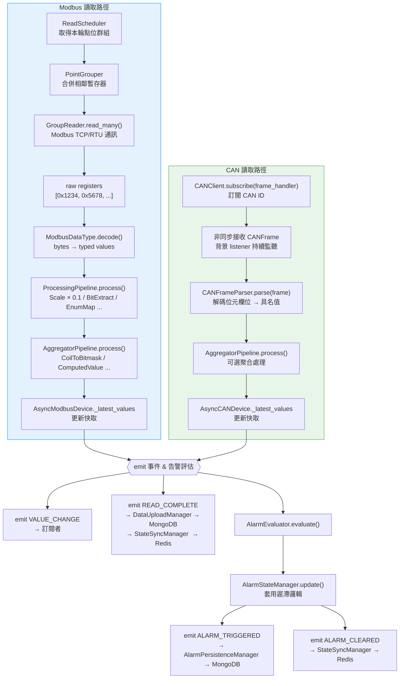
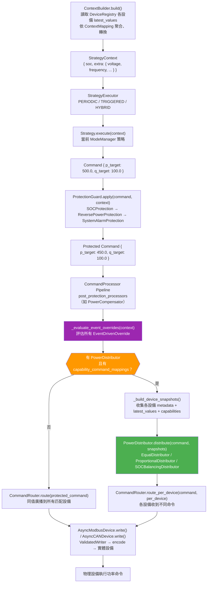
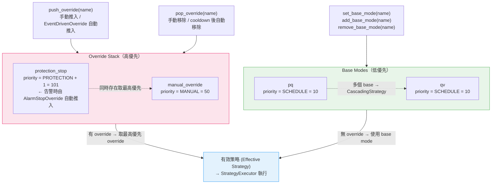
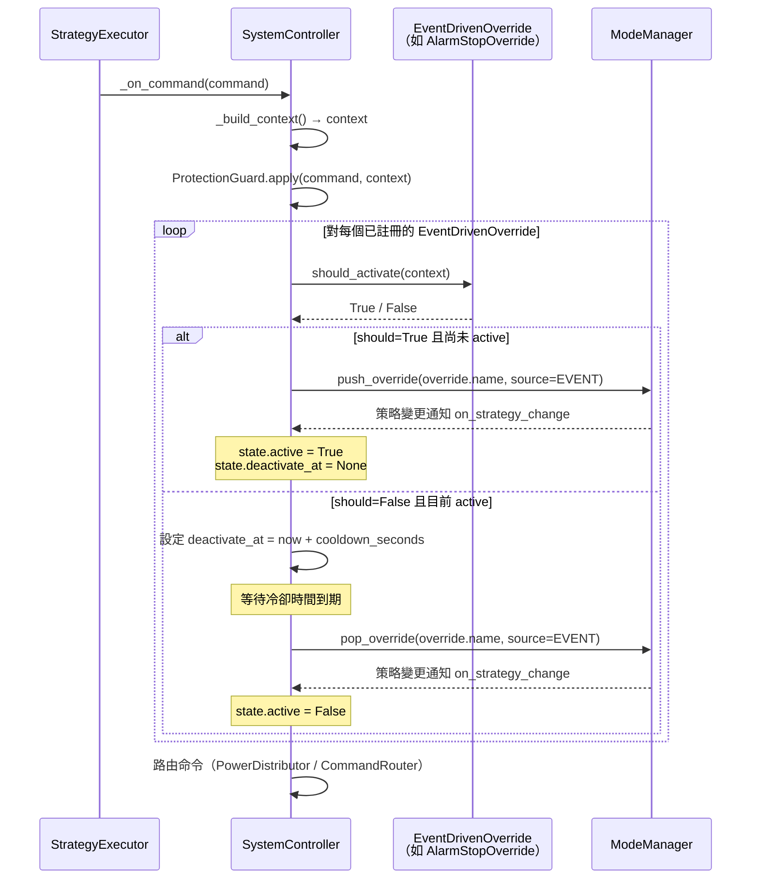

# Data Flow

> 核心資料流圖 — 讀取循環、控制循環、模式切換、事件驅動覆蓋

## 4.1 讀取循環（每 1~60 秒）

設備週期性讀取的完整資料流，從排程到事件發射。CAN 設備讀取路徑與 Modbus 路徑並列運行。

> [!note] CAN snapshot loop
> `AsyncCANDevice` 的 `VALUE_CHANGE` 事件由 RX handler 即時發射（每收到訊框即觸發），
> 而 `READ_COMPLETE` 與告警評估則由獨立的 `_snapshot_loop` 以 `read_interval` 週期統一觸發，
> 避免高頻 CAN 訊框造成不必要的上游 I/O。

### 關鍵元件

| 元件 | 職責 | 頁面 |
|------|------|------|
| [[ReadScheduler]] | 管理固定 + 輪替排程 | [[_MOC Equipment]] |
| [[PointGrouper]] | 合併相鄰暫存器以減少請求 | [[_MOC Equipment]] |
| [[GroupReader]] | 批次讀取 + 解碼 | [[_MOC Equipment]] |
| [[ModbusDataType]] | 二進位 → 型別值解碼 | [[_MOC Modbus]] |
| [[ProcessingPipeline]] | Transform 串接處理 | [[_MOC Equipment]] |
| [[CANFrameParser]] | CAN 訊框位元欄位解碼 | [[CANEncoder]] |
| [[AsyncCANDevice]] | CAN 設備讀寫與事件發射 | [[AsyncCANDevice]] |
| [[AlarmStateManager]] | 遲滯邏輯告警管理 | [[_MOC Equipment]] |
| [[DeviceEventEmitter]] | 非同步事件發射 | [[Event System]] |
| [[DataUploadManager]] | 批次上傳至 MongoDB | [[_MOC Manager]] |
| [[StateSyncManager]] | 即時同步至 Redis | [[_MOC Manager]] |

---

## 4.2 控制循環

從設備數據聚合到功率命令寫入的完整流程，包含 [[PowerDistributor]] 分支，支援 per-device 不同命令分配。

> [!note] alarm_mode per_device
> 若 `SystemControllerConfig.alarm_mode == "per_device"`，控制循環結尾還會呼叫
> `_handle_device_alarms()`，對每台告警設備單獨執行關機動作，而非觸發系統級 override。

### 關鍵元件

| 元件 | 職責 | 頁面 |
|------|------|------|
| [[ContextBuilder]] | 設備數據 → [[StrategyContext]] | [[_MOC Integration]] |
| [[DeviceRegistry]] | Trait-based 設備查詢 | [[_MOC Integration]] |
| [[StrategyExecutor]] | 週期 / 觸發 / 混合模式執行 | [[_MOC Controller]] |
| [[ProtectionGuard]] | 保護規則鏈 | [[_MOC Controller]] |
| [[CommandProcessor]] | Post-Protection 命令處理管線 | [[_MOC Controller]] |
| [[PowerCompensator]] | FF + I 閉環功率補償（實作 CommandProcessor） | [[_MOC Controller]] |
| [[EventDrivenOverride]] | 事件條件 → 自動 push/pop override | [[EventDrivenOverride]] |
| [[PowerDistributor]] | 系統命令 → per-device 功率分配 | [[PowerDistributor]] |
| [[CommandRouter]] | Command → 設備寫入路由 | [[_MOC Integration]] |
| [[ValidatedWriter]] | 驗證 + 寫入 + 回讀（Modbus） | [[_MOC Equipment]] |
| [[AsyncCANDevice]] | CAN 命令寫入（Frame Buffer） | [[AsyncCANDevice]] |

---

## 4.3 模式切換流程

[[ModeManager]] 管理多模式優先級切換，支援基礎模式與覆蓋模式。[[EventDrivenOverride]] 統一負責條件式 push/pop，取代原本硬編碼的 `_handle_auto_stop`。

### 運作機制

1. **基礎模式 (Base Mode)** — 正常運行時使用的策略，可用 `add_base_mode()` 同時啟用多個
2. **覆蓋模式 (Override)** — 高優先級事件觸發，優先於所有基礎模式
3. **多策略級聯** — 當有多個基礎模式且設定 `capacity_kva` 時，自動組合為 [[CascadingStrategy]]
4. **優先級堆疊** — Override 以堆疊方式管理，`pop_override` 後自動恢復前一有效策略
5. **事件驅動** — [[EventDrivenOverride]] 可自動依 context 條件 push/pop，含冷卻防抖

### 關鍵元件

| 元件 | 職責 | 頁面 |
|------|------|------|
| [[ModeManager]] | 模式註冊、切換、優先級管理 | [[_MOC Controller]] |
| [[CascadingStrategy]] | 多策略功率級聯分配 | [[_MOC Controller]] |
| [[ProtectionGuard]] | 觸發自動停機覆蓋 | [[_MOC Controller]] |
| [[EventDrivenOverride]] | 條件驅動的自動 push/pop | [[EventDrivenOverride]] |
| [[AlarmStopOverride]] | 告警自動停機（內建實作） | [[EventDrivenOverride]] |

---

## 4.4 事件驅動覆蓋流程

`EventDrivenOverride` 協定讓控制器在每個執行週期自動評估條件，無需外部手動干預即可切換模式。

> [!note] 冷卻機制
> `cooldown_seconds` 防止條件在臨界值附近頻繁抖動。`AlarmStopOverride` 的冷卻時間為 `0.0`（即
> 告警解除後立即恢復），而 `ContextKeyOverride` 預設 `5.0` 秒。

> [!tip] 自訂 EventDrivenOverride
> 任何實作 `should_activate(context) -> bool`、`name`、`cooldown_seconds` 的類別均符合
> `EventDrivenOverride` Protocol（`@runtime_checkable`），可直接傳入
> `SystemController.register_event_override()`。

### 關鍵元件

| 元件 | 職責 | 頁面 |
|------|------|------|
| [[EventDrivenOverride]] | 條件驅動 override 協定 | [[EventDrivenOverride]] |
| [[AlarmStopOverride]] | 告警 → 自動停機（`cooldown=0`） | [[EventDrivenOverride]] |
| [[ContextKeyOverride]] | 通用 context.extra key 觸發器 | [[EventDrivenOverride]] |
| [[ModeManager]] | 接收 push/pop 指令並切換策略 | [[_MOC Controller]] |
| [[SystemController]] | 統一評估 `_evaluate_event_overrides` | [[SystemController]] |

---

## 相關頁面

- [[Layered Architecture]] — 各層職責與依賴關係
- [[Design Patterns]] — 相關設計模式（Strategy、Command、Chain of Responsibility）
- [[Event System]] — 資料流中的事件機制
- [[EventDrivenOverride]] — 事件驅動覆蓋協定與內建實作
- [[PowerDistributor]] — 功率分配器實作（EqualDistributor / ProportionalDistributor / SOCBalancingDistributor）
- [[AsyncCANDevice]] — CAN 設備讀寫架構
- [[SystemController]] — 頂層控制器完整 API
- [[_MOC Architecture]] — 返回架構索引
