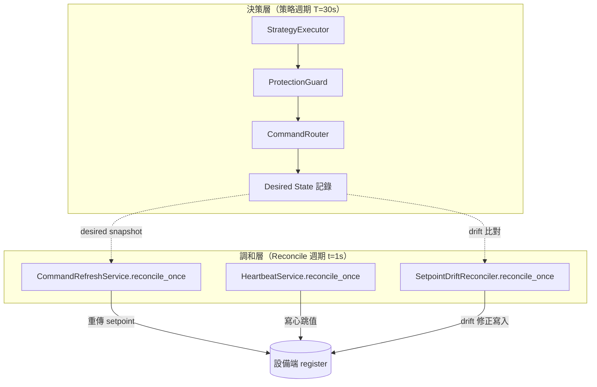

---
tags:
  - type/architecture
  - layer/integration
  - status/complete
source: csp_lib/integration/operator.py
created: 2026-04-20
updated: 2026-04-20
version: ">=0.9.0"
---

# Operator Pattern（K8s 風）

csp_lib v0.9.0 正式引入 `Reconciler` Protocol，把 v0.8.1 的 `CommandRefreshService` 從「服務內部機制」提升為「可組合的調和器架構」。本文說明此模式的設計原則、Protocol 契約，以及三個現行實作。

## 概念模型：Desired State vs Actual State

Kubernetes Operator Pattern 的核心思想可直接對應到 BESS 控制情境：

| 概念 | Kubernetes | csp_lib |
|------|-----------|---------|
| **Desired State** | CRD Spec（使用者宣告） | `CommandRouter._last_written`、HeartbeatConfig 目標值 |
| **Actual State** | 叢集中實際執行狀態 | 設備端 Modbus register 的當前值 |
| **Reconcile Loop** | Controller 週期比對並修復偏差 | `Reconciler.reconcile_once()` 週期執行 |
| **Controller Manager** | `controller-manager` 進程 | `SystemController`（生命週期宿主） |

關鍵原則：

- **Reconciler 不決策**：不跑控制策略、不計算新的目標值，只負責「把已決策的 desired state 推到設備端」
- **Idempotent**：同一 reconciler 多次執行結果相同；正常情況下設備值等於 desired state，多次執行不會累積副作用
- **不 raise**：`reconcile_once()` 把錯誤記錄在 `ReconcilerStatus.last_error` 中回傳，不向呼叫者拋例外；`SystemController` 藉此在任一 reconciler 失敗時繼續執行其他 reconciler



## Reconciler Protocol 契約

```python
from csp_lib.integration import Reconciler, ReconcilerStatus

# @runtime_checkable Protocol
class Reconciler(Protocol):
    @property
    def name(self) -> str: ...

    @property
    def status(self) -> ReconcilerStatus: ...

    async def reconcile_once(self) -> ReconcilerStatus: ...
```

### 設計約束

| 約束 | 說明 |
|------|------|
| `@runtime_checkable` | 可用 `isinstance(obj, Reconciler)` 在執行期確認實作 |
| `reconcile_once` 不 raise | 錯誤透過回傳的 `ReconcilerStatus.last_error` 傳遞；`SystemController` 以此確保一個 reconciler 失敗不中斷其他 reconciler |
| 冪等性 | 連續多次呼叫 `reconcile_once()` 不應產生累積效果；若設備值已等於 desired state，不應改變任何狀態 |
| `name` 唯一建議 | 同一個 `SystemController` 內建議 reconciler name 唯一，方便觀測與日誌識別 |

## ReconcilerStatus 欄位

```python
@dataclass(frozen=True, slots=True)
class ReconcilerStatus:
    name: str                          # reconciler 識別名
    last_run_at: float | None          # 最近一次執行的 monotonic 時間戳
    last_error: str | None             # 最近一次錯誤訊息；None 表示成功
    run_count: int                     # 總執行次數
    healthy: bool                      # True = 最近一次執行無錯誤
    detail: Mapping[str, Any]          # reconciler-specific 唯讀 metadata（預設空 MappingProxyType）
```

工廠方法：

```python
# 建立初始空狀態
status = ReconcilerStatus.empty("my_reconciler")
```

## 三個現行實作對照

| 實作 | Desired State 來源 | 寫入目標 | 典型場景 |
|------|-------------------|---------|---------|
| `CommandRefreshService` | `CommandRouter._last_written` | 設備 setpoint register | PCS watchdog 保活 + 斷線恢復 |
| `HeartbeatService` | `HeartbeatConfig`（toggle/counter/constant）| 設備心跳 register | BESS / Meter 存活信號 |
| `SetpointDriftReconciler` | 最新已寫入值（`device.latest_values` cached）| drift 偏大的設備 register | Gateway 外部寫入覆蓋偵測與修正 |

### CommandRefreshService（v0.8.1，v0.9.0 加入 Protocol）

- 新增 keyword-only 參數 `name="command_refresh"`（預設值向後相容）
- 新增 `status: ReconcilerStatus` property 與 `reconcile_once()` 方法

```python
from csp_lib.integration import CommandRefreshService, CommandRefreshConfig

config = (
    SystemControllerConfig.builder()
    .command_refresh(interval_seconds=1.0, enabled=True)
    .build()
)
# 或直接使用
svc = CommandRefreshService(router, interval=1.0, name="command_refresh")
```

### HeartbeatService（v0.8.1，v0.9.0 加入 Protocol）

- 新增 keyword-only 參數 `name="heartbeat"`（預設值向後相容）
- paused 狀態下 `reconcile_once()` 跳過寫入但回傳 `healthy=True`（暫停是預期行為，非錯誤）

```python
from csp_lib.integration import HeartbeatService, HeartbeatConfig

config = (
    SystemControllerConfig.builder()
    .heartbeat(HeartbeatConfig(...))
    .build()
)
```

### SetpointDriftReconciler（v0.9.0 新增）

- 比對 `desired_value`（最後已寫入值）vs `actual_value`（`device.latest_values` cached dict）
- 若 drift 超過 `DriftTolerance`（absolute 或 relative），重新呼叫 `CommandRouter.try_write_single`
- 不額外發起 Modbus 讀取，使用設備最近一次讀取的快取值

```python
from csp_lib.integration import SetpointDriftReconciler, DriftTolerance

reconciler = SetpointDriftReconciler(
    router=router,
    registry=registry,
    tolerance=DriftTolerance(absolute=5.0, relative=0.02),  # 5 kW 或 2% 容忍
    name="setpoint_drift",
)
```

## 與 entry_points 的互補關係

`Reconciler` Protocol 管理**執行期的狀態維持**，`entry_points` Plugin 機制（`ENTRY_POINT_GROUP`）管理**策略型別的靜態發現**：

| 機制 | 解決問題 | 時機 |
|------|---------|------|
| `Reconciler` Protocol | 執行時持續維持 desired state | 每個 reconcile 週期 |
| `entry_points` 策略發現 | 讓外部套件的 Strategy 被 `ModeManager` 自動識別 | 系統啟動時 |
| `TypeRegistry` | 讓 manifest 中的 `kind: "ExamplePCS"` 動態映射到設備類別 | manifest 載入時 |

三者合力構成「config-driven、可插拔、狀態自我修復」的完整 Operator 架構。

## 快速範例

```python
import asyncio
from csp_lib.integration import (
    Reconciler, ReconcilerStatus,
    SetpointDriftReconciler, DriftTolerance,
)

# 自訂 Reconciler 實作範例
class ConfigReconciler:
    """把 RuntimeParameters 快照定期持久化到 Redis（自訂 Reconciler）"""

    def __init__(self, params, redis_client, *, name: str = "config_sync") -> None:
        self._params = params
        self._redis = redis_client
        self._status = ReconcilerStatus.empty(name)

    @property
    def name(self) -> str:
        return self._status.name

    @property
    def status(self) -> ReconcilerStatus:
        return self._status

    async def reconcile_once(self) -> ReconcilerStatus:
        import time
        try:
            snapshot = self._params.snapshot()
            await self._redis.set("params:snapshot", str(snapshot))
            self._status = ReconcilerStatus(
                name=self.name,
                last_run_at=time.monotonic(),
                last_error=None,
                run_count=self._status.run_count + 1,
                healthy=True,
                detail="",
            )
        except Exception as exc:
            self._status = ReconcilerStatus(
                name=self.name,
                last_run_at=time.monotonic(),
                last_error=str(exc),
                run_count=self._status.run_count + 1,
                healthy=False,
                detail="",
            )
        return self._status

# 執行期確認是否符合 Protocol
assert isinstance(ConfigReconciler(None, None), Reconciler)
```

## 相關頁面

- [[Reconciliation Pattern]] — v0.8.1 引入的調和器模式說明（`CommandRefreshService` 架構細節）
- [[Site Manifest]] — YAML 驅動的站點配置與 Operator 部署
- [[Command Refresh]] — `CommandRefreshService` 使用指南
- [[SystemController]] — Reconciler 生命週期管理宿主
- [[Design Patterns]] — csp_lib 整體設計模式概覽
