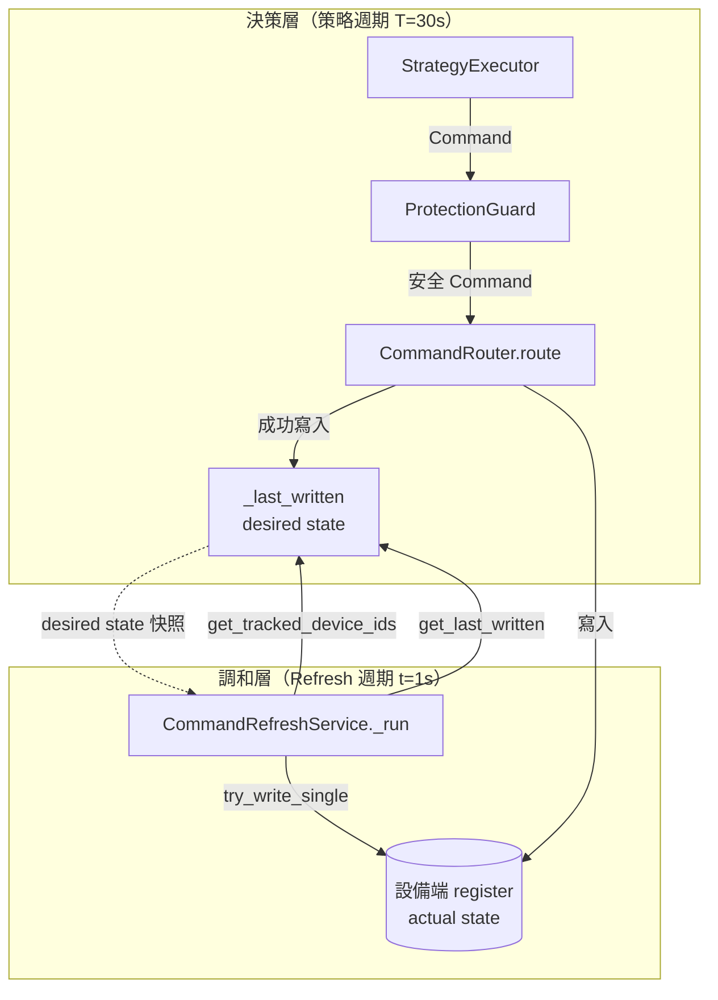

---
tags:
  - type/architecture
  - layer/integration
  - status/complete
created: 2026-04-17
updated: 2026-04-20
version: ">=0.9.0"
---

# Reconciliation Pattern（調和器模式）

csp_lib v0.8.1 引入 `CommandRefreshService` 作為 Kubernetes Operator 式 reconciler 的第一個具體實作。本文說明此設計模式，以及它在 csp_lib 架構中的定位與未來擴展方向。

## 類比：Kubernetes Operator Pattern

Kubernetes Controller 的核心思想是「宣告式 vs. 命令式」：

| 概念 | Kubernetes | csp_lib |
|------|-----------|---------|
| Desired State | CRD Spec（使用者宣告） | `CommandRouter._last_written`（策略輸出意圖） |
| Actual State | 叢集中實際執行的 Pod | 設備端目前的 register 值（可能被斷線/重啟/外部干預改動） |
| Reconcile Loop | Controller 持續比對 Desired vs. Actual | `CommandRefreshService._run()` 週期重寫 desired state |
| Controller Manager | `controller-manager` 進程 | `SystemController`（生命週期管理器） |

關鍵差異：reconciler **不決策**（不跑策略），只負責**維持意圖**（把已決策的結果持續推到設備端）。

## CommandRefreshService 的 Reconciler 架構



## 核心不變式

reconciler 的正確性依賴以下不變式：

1. **Desired state 只由業務值填充**：`NO_CHANGE` 軸跳過寫入，不污染 `_last_written`
2. **Refresh 不觸發新決策**：`CommandRefreshService` 只呼叫 `try_write_single`，不走 `ProtectionGuard` / `PowerCompensator`
3. **設備保護優先**：`try_write_single` 仍檢查 `is_protected`，protected 設備不被 refresh 覆蓋
4. **時間錨定不漂移**：使用 `next_tick_delay` 絕對時間錨定，與策略執行週期不互相影響

## CommandRefreshService 實作細節

```python
async def _run(self) -> None:
    """主迴圈：work-first + 絕對時間錨定"""
    anchor = time.monotonic()
    completed = 0

    while not self._stop_event.is_set():
        # 1. Work-first：先執行 reconcile，再計算下一個 tick
        await self._refresh_once()

        # 2. 絕對時間錨定：補償 _refresh_once 的執行耗時
        delay, anchor, completed = next_tick_delay(anchor, completed, self._interval)
        if delay <= 0:
            await asyncio.sleep(0)  # 讓出 event loop
            continue

        # 3. 等到下個 tick 或收到 stop 信號
        try:
            await asyncio.wait_for(self._stop_event.wait(), timeout=delay)
            break
        except asyncio.TimeoutError:
            pass  # 正常 tick
```

Work-first 語義（與 `StrategyExecutor` v0.8.0 相同）：服務啟動後**立即**執行第一次 reconcile，再排程後續週期。這確保 `SystemController._on_start` 完成後立即恢復 desired state，而不是等一個 interval 後才開始。

## v0.9.0 Reconciler Protocol（已實作）

v0.9.0 正式抽取 `Reconciler` Protocol，讓 `SystemController` 以統一的生命週期管理多個 reconciler。`CommandRefreshService` 與 `HeartbeatService` 均已實作此 Protocol（相容保留舊 API）：

```python
from csp_lib.integration import Reconciler, ReconcilerStatus

# @runtime_checkable Protocol
class Reconciler(Protocol):
    @property
    def name(self) -> str: ...

    @property
    def status(self) -> ReconcilerStatus: ...

    async def reconcile_once(self) -> ReconcilerStatus: ...
```

三個現行 Reconciler 實作：

| Reconciler | Desired State | 引入版本 |
|-----------|---------------|---------|
| `CommandRefreshService` | `CommandRouter._last_written`（setpoint 維持）| v0.8.1（Protocol: v0.9.0）|
| `HeartbeatService` | `HeartbeatConfig`（心跳值）| v0.8.1（Protocol: v0.9.0）|
| `SetpointDriftReconciler` | `device.latest_values`（drift 偵測修正）| v0.9.0 |

詳見 [[Operator Pattern]]（K8s 風 Operator Pattern 完整說明）與 [[Site Manifest]]（YAML 驅動配置）。

## 與 csp_lib 其他時間錨定元件的一致性

csp_lib 中多個元件採用相同的 `next_tick_delay` 機制（`csp_lib.core._time_anchor`）：

| 元件 | 典型週期 | 引入版本 |
|------|---------|---------|
| `StrategyExecutor` PERIODIC/HYBRID | 0.3 s – 30 s | v0.8.0 |
| `CommandRefreshService` | 1 s – 5 s | v0.8.1 |
| `SinkManager._poll_remote_level` | 30 s | v0.7.3 |
| `DeviceGroup._sequential_loop` | 每步 0.1 s | v0.7.3 |
| `CommunicationWatchdog._check_loop` | 1 s | v0.7.3 |
| `SystemMonitor._run_loop` | 10 s | v0.7.3 |

所有長期執行的背景 loop 都應使用此機制，而非 `asyncio.sleep(interval)` 相對等待。

## 相關頁面

- [[Command Refresh]] — 使用指南與完整配置
- [[CommandRouter]] — desired state 的來源
- [[SystemController]] — reconciler 的生命週期管理者
- [[Design Patterns]] — csp_lib 整體設計模式概覽
- [[Layered Architecture]] — 分層架構與依賴方向
