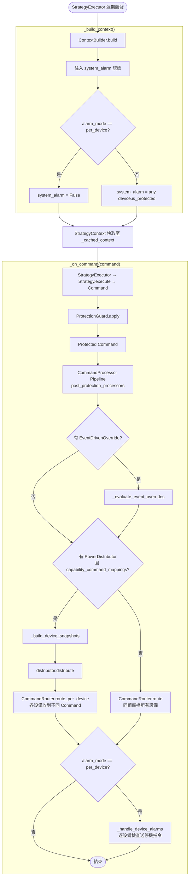
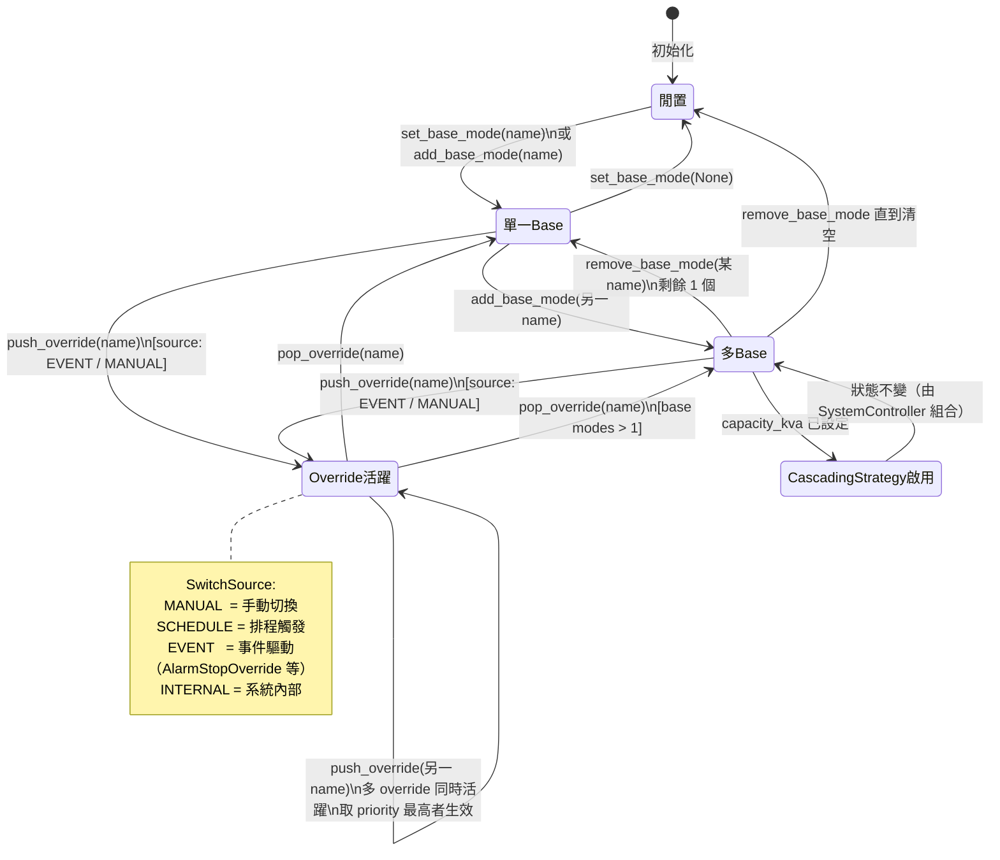
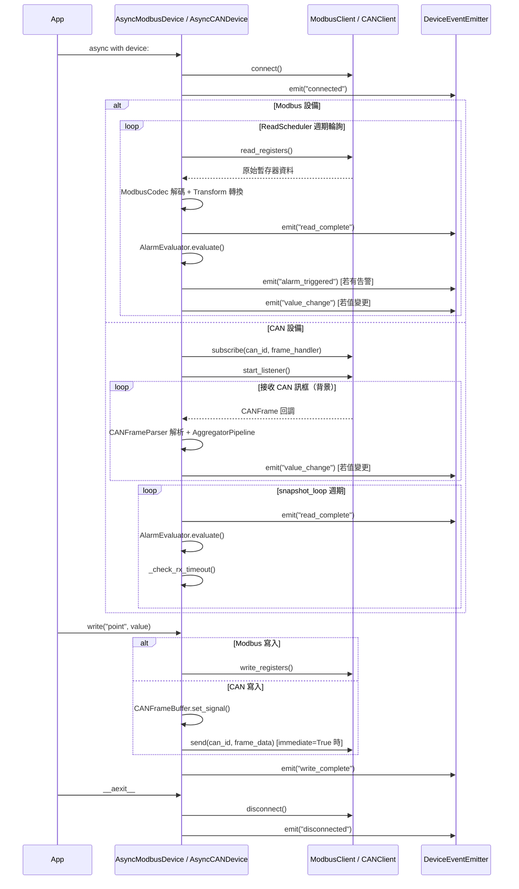
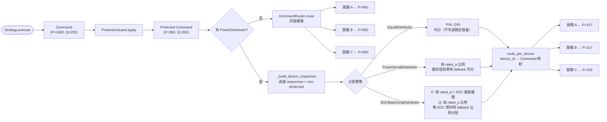
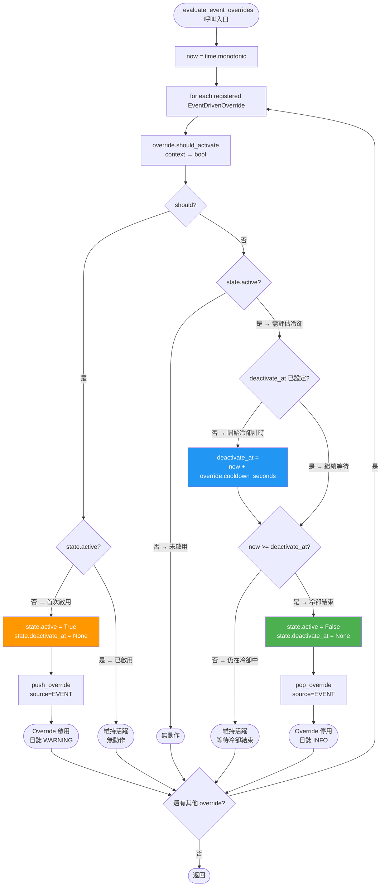

---
tags:
  - type/diagram
  - layer/architecture
  - status/complete
created: 2026-03-06
updated: 2026-04-04
version: 0.6.1
---

# System Diagrams

csp_lib v0.6 系統圖表集，以 Mermaid 語法呈現系統總覽、核心流程、狀態機與設備生命週期。

---

## 1. 系統總覽架構圖

v0.6 完整 8 層架構。依賴方向由下往上；CAN（Layer 2b）與 Modbus（Layer 2a）並列於 Layer 2。

```mermaid
graph TB
    subgraph L8["Layer 8 ── Additional"]
        L8A[cluster]
        L8B[monitor]
        L8C[notification]
        L8D[modbus_server]
        L8E[gui]
        L8F[modbus_gateway]
        L8G[statistics]
    end

    subgraph L7["Layer 7 ── Storage"]
        L7A[MongoClient]
        L7B[RedisClient]
    end

    subgraph L6["Layer 6 ── Integration"]
        L6A[DeviceRegistry]
        L6B[ContextBuilder]
        L6C[CommandRouter]
        L6D[SystemController]
        L6E[PowerDistributor]
        L6F[HeartbeatService]
    end

    subgraph L5["Layer 5 ── Manager"]
        L5A[UnifiedDeviceManager]
        L5B[AlarmPersistenceManager]
        L5C[DataUploadManager]
    end

    subgraph L4["Layer 4 ── Controller"]
        L4A["策略 × 9
PQMode / QV / FP / Island
PVSmooth / Schedule / Stop
Bypass / LoadShedding"]
        L4B[StrategyExecutor]
        L4C[ModeManager]
        L4D[ProtectionGuard]
        L4E[EventDrivenOverride]
        L4F[LoadSheddingStrategy]
        L4G[CommandProcessor]
        L4H[PowerCompensator]
    end

    subgraph L3["Layer 3 ── Equipment"]
        L3A[AsyncModbusDevice]
        L3B[AsyncCANDevice]
        L3C[DeviceProtocol]
        L3D[ReadScheduler]
        L3E[AlarmStateManager]
        L3F[CANEncoder]
        L3G[PeriodicSendScheduler]
    end

    subgraph L2a["Layer 2a ── Modbus"]
        L2aA[ModbusDataType]
        L2aB[AsyncModbusClientBase]
        L2aC[ModbusCodec]
        L2aD[ModbusRequestQueue]
    end

    subgraph L2b["Layer 2b ── CAN"]
        L2bA[CANBusConfig]
        L2bB[AsyncCANClientBase]
        L2bC[PythonCANClient]
    end

    subgraph L1["Layer 1 ── Core"]
        L1A[AsyncLifecycleMixin]
        L1B[CircuitBreaker]
        L1C[RetryPolicy]
        L1D[HealthCheckable]
        L1E[RuntimeParameters]
    end

    L8 --> L6
    L8 --> L7
    L7 --> L5
    L6 --> L5
    L6 --> L4
    L6 --> L3
    L5 --> L4
    L5 --> L3
    L4 --> L3
    L3 --> L2a
    L3 --> L2b
    L2a --> L1
    L2b --> L1
```

### 關鍵元件

| 元件 | 職責 | 頁面 |
|------|------|------|
| `AsyncLifecycleMixin` | 所有生命週期元件的 `async with` 基底 | [[Layered Architecture]] |
| `CircuitBreaker` | 通用斷路器（Core 層，v0.4.2 移入） | [[_MOC Core]] |
| `DeviceProtocol` | 統一 Modbus/CAN 設備介面的 Protocol | [[DeviceProtocol]] |
| `SystemController` | 頂層控制器，整合所有 Layer 4–6 元件 | [[SystemController]] |
| `PowerDistributor` | 系統級 Command 分配到多設備 | [[PowerDistributor]] |

---

## 2. SystemController 內部編排流程圖

展示 `SystemController` 在每個執行週期中 `_build_context()` 與 `_on_command()` 的完整決策路徑。

### 關鍵元件

| 元件 | 職責 | 頁面 |
|------|------|------|
| `ContextBuilder` | 讀取設備點位、組裝 `StrategyContext` | [[ContextBuilder]] |
| `StrategyExecutor` | 以固定週期或事件驅動呼叫策略 | [[SystemController]] |
| `ProtectionGuard` | 套用 SOC 限制、逆送保護等保護規則 | [[SystemController]] |
| `CommandProcessor` | Post-Protection 命令處理管線 | [[CommandProcessor]] |
| `EventDrivenOverride` | 條件驅動的自動 push/pop override | [[EventDrivenOverride]] |
| `PowerDistributor` | 將系統 Command 分配到各設備 | [[PowerDistributor]] |
| `CommandRouter` | 將 Command 欄位寫入對應設備點位 | [[CommandRouter]] |

---

## 3. ModeManager 狀態轉換圖

展示 `ModeManager` 的模式管理狀態機，包含 base mode 列表與 override 堆疊的切換邏輯。

### 關鍵元件

| 元件 | 職責 | 頁面 |
|------|------|------|
| `ModeManager` | 管理 base mode 列表與 override 堆疊 | [[ModeManager]] |
| `SwitchSource` | 模式切換來源審計標記 | [[ModeManager]] |
| `CascadingStrategy` | 多 base mode 共存時的組合策略 | [[SystemController]] |
| `ModePriority` | 預設優先等級（SCHEDULE=10、MANUAL=50、PROTECTION=100） | [[ModeManager]] |

---

## 4. 設備生命週期序列圖

對比 `AsyncModbusDevice`（Modbus 輪詢）與 `AsyncCANDevice`（CAN 訂閱）的啟動、讀取、寫入與關閉流程。

### 關鍵元件

| 元件 | 職責 | 頁面 |
|------|------|------|
| `AsyncModbusDevice` | Modbus 輪詢設備，ReadScheduler 驅動 | [[_MOC Equipment]] |
| `AsyncCANDevice` | CAN 訂閱設備，snapshot_loop 週期發射事件 | [[AsyncCANDevice]] |
| `DeviceEventEmitter` | 統一事件分發（connected/read_complete/value_change 等） | [[_MOC Equipment]] |
| `AlarmStateManager` | 告警狀態管理與 `is_protected` 旗標 | [[_MOC Equipment]] |
| `PeriodicSendScheduler` | CAN 定期發送排程（TX 週期控制） | [[PeriodicSendScheduler]] |

---

## 5. 功率分配流程圖

從 `Strategy.execute()` 輸出到各設備寫入的完整路徑，重點展示 `PowerDistributor` 的三種分配策略。

### 關鍵元件

| 元件 | 職責 | 頁面 |
|------|------|------|
| `EqualDistributor` | 均分分配，適合規格相同的設備群 | [[PowerDistributor]] |
| `ProportionalDistributor` | 按 `rated_p`（或自訂 key）比例分配 | [[PowerDistributor]] |
| `SOCBalancingDistributor` | P 依 SOC 偏差調整，Q 按額定比例 | [[PowerDistributor]] |
| `DeviceSnapshot` | 設備狀態快照（metadata + latest_values + capabilities） | [[PowerDistributor]] |
| `CommandRouter.route_per_device` | 將 per-device Command 映射寫入各設備 | [[CommandRouter]] |

---

## 6. 事件驅動 Override 評估流程圖

展示 `_evaluate_event_overrides()` 在每個執行週期中對所有已註冊 `EventDrivenOverride` 的完整決策邏輯，包含冷卻計時機制。

### 關鍵元件

| 元件 | 職責 | 頁面 |
|------|------|------|
| `EventDrivenOverride` | 條件驅動 override 的 Protocol（`should_activate` + `cooldown_seconds`） | [[EventDrivenOverride]] |
| `AlarmStopOverride` | 內建實作：`system_alarm == True` 時啟用停機 override | [[EventDrivenOverride]] |
| `ContextKeyOverride` | 內建實作：根據 `context.extra` 任意 key 觸發 override | [[EventDrivenOverride]] |
| `_OverrideState` | 內部狀態追蹤（`active` + `deactivate_at`） | [[SystemController]] |
| `ModeManager.push_override` | 以 `source=EVENT` 推入 override 並通知策略變更 | [[ModeManager]] |

---

## 相關頁面

| 類別 | 頁面 |
|------|------|
| 分層架構詳解 | [[Layered Architecture]] |
| 資料流說明 | [[Data Flow]] |
| 非同步模式 | [[Async Patterns]] |
| 事件系統 | [[Event System]] |
| Integration 模組索引 | [[_MOC Integration]] |
| Controller 模組索引 | [[_MOC Controller]] |
| Equipment 模組索引 | [[_MOC Equipment]] |
| SystemController API | [[SystemController]] |
| PowerDistributor API | [[PowerDistributor]] |
| ModeManager API | [[ModeManager]] |
| EventDrivenOverride API | [[EventDrivenOverride]] |
| CommandRouter API | [[CommandRouter]] |
| AsyncCANDevice API | [[AsyncCANDevice]] |
| DeviceProtocol API | [[DeviceProtocol]] |
| PeriodicSendScheduler API | [[PeriodicSendScheduler]] |
