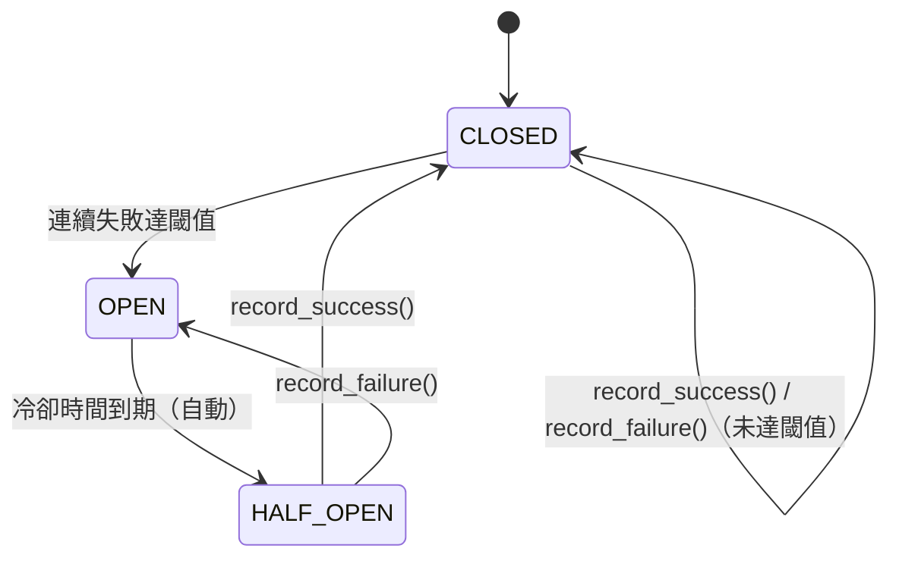

---
tags:
  - type/class
  - layer/core
  - status/complete
source: csp_lib/core/resilience.py
created: 2026-03-06
updated: 2026-04-04
version: v0.6.1
---

# Resilience

> 通用韌性模組 — 斷路器與重試策略

回到 [[_MOC Core]]

提供跨層共用的韌性機制，用於保護對外部設備（Modbus、CAN Bus、資料庫等）的連線呼叫，避免連鎖失敗與資源耗盡。

```python
from csp_lib.core import CircuitBreaker, CircuitState, RetryPolicy
```

---

## CircuitState

斷路器狀態列舉，描述斷路器目前所處的狀態。

```python
from csp_lib.core import CircuitState

class CircuitState(Enum):
    CLOSED    = "closed"     # 正常運作，允許請求通過
    OPEN      = "open"       # 已斷路，拒絕所有請求
    HALF_OPEN = "half_open"  # 冷卻結束，允許探測請求
```

| 狀態 | 說明 |
|------|------|
| `CLOSED` | 正常運作；失敗次數未達閾值 |
| `OPEN` | 已斷路；冷卻期間拒絕所有請求 |
| `HALF_OPEN` | 冷卻完成；允許一次探測請求決定是否恢復 |

---

## CircuitBreaker

通用斷路器，追蹤連續失敗次數並控制請求是否允許通過。

```python
class CircuitBreaker:
    def __init__(
        self,
        threshold: int,
        cooldown: float,
        max_cooldown: float = 300.0,
        backoff_factor: float = 2.0,
    ) -> None
```

### 建構參數

| 參數 | 型別 | 預設值 | 說明 |
|------|------|--------|------|
| `threshold` | `int` | — | 連續失敗達此次數後觸發斷路（切換至 `OPEN`） |
| `cooldown` | `float` | — | 斷路器開啟後的基礎冷卻時間（秒） |
| `max_cooldown` | `float` | `300.0` | 指數退避的最大冷卻時間（秒） |
| `backoff_factor` | `float` | `2.0` | 指數退避的倍率 |

### 屬性

| 屬性 | 型別 | 說明 |
|------|------|------|
| `state` | `CircuitState` | 目前斷路器狀態（含自動 `OPEN → HALF_OPEN` 轉換） |
| `failure_count` | `int` | 目前連續失敗次數 |

### 方法

| 方法 | 說明 |
|------|------|
| `record_success() -> None` | 記錄成功：重置失敗計數，切換至 `CLOSED` |
| `record_failure() -> None` | 記錄失敗：累計失敗次數，達閾值時切換至 `OPEN` |
| `reset() -> None` | 手動重置斷路器（回到 `CLOSED`，清除計數與時間） |
| `allows_request() -> bool` | 回傳 `True` 表示目前狀態允許請求通過（非 `OPEN`） |

### 狀態轉換圖



### 使用範例

```python
from csp_lib.core import CircuitBreaker, CircuitState

cb = CircuitBreaker(threshold=3, cooldown=30.0)

async def safe_read():
    if not cb.allows_request():
        raise RuntimeError("斷路器開啟，跳過請求")

    try:
        result = await device.read()
        cb.record_success()
        return result
    except CommunicationError:
        cb.record_failure()
        raise

# 查看狀態
print(cb.state)          # CircuitState.CLOSED
print(cb.failure_count)  # 0
```

---

## RetryPolicy

重試策略配置，使用指數退避算法計算每次重試的延遲時間。

```python
@dataclass(frozen=True, slots=True)
class RetryPolicy:
    max_retries: int = 3
    base_delay: float = 1.0
    exponential_base: float = 2.0
```

### 欄位

| 欄位 | 型別 | 預設值 | 說明 |
|------|------|--------|------|
| `max_retries` | `int` | `3` | 最大重試次數 |
| `base_delay` | `float` | `1.0` | 基礎延遲（秒） |
| `exponential_base` | `float` | `2.0` | 指數退避的基數 |

### 方法

| 方法 | 說明 |
|------|------|
| `get_delay(attempt: int) -> float` | 計算第 N 次重試的延遲時間（`base_delay × exponential_base^attempt`） |

### 延遲計算範例

使用預設值（`base_delay=1.0`，`exponential_base=2.0`）：

| 嘗試次數（`attempt`） | 延遲（秒） |
|----------------------|-----------|
| 0（第 1 次重試） | 1.0 |
| 1（第 2 次重試） | 2.0 |
| 2（第 3 次重試） | 4.0 |

### 使用範例

```python
import asyncio
from csp_lib.core import RetryPolicy

policy = RetryPolicy(max_retries=3, base_delay=1.0, exponential_base=2.0)

async def with_retry(func):
    for attempt in range(policy.max_retries):
        try:
            return await func()
        except Exception:
            if attempt == policy.max_retries - 1:
                raise
            delay = policy.get_delay(attempt)
            await asyncio.sleep(delay)
```

---

## 組合使用

斷路器與重試策略通常配合使用，形成完整的韌性保護：

```python
from csp_lib.core import CircuitBreaker, RetryPolicy

cb = CircuitBreaker(threshold=5, cooldown=60.0)
policy = RetryPolicy(max_retries=3, base_delay=0.5)

async def resilient_read():
    if not cb.allows_request():
        raise RuntimeError("斷路器開啟")

    for attempt in range(policy.max_retries):
        try:
            result = await device.read()
            cb.record_success()
            return result
        except CommunicationError:
            cb.record_failure()
            if attempt < policy.max_retries - 1:
                await asyncio.sleep(policy.get_delay(attempt))
    raise CommunicationError("重試耗盡")
```

---

## 相關頁面

- [[AsyncLifecycleMixin]] — 設備生命週期管理基底
- [[Error Hierarchy]] — `CommunicationError` 等例外類別
- [[_MOC Core]] — Core 模組總覽
