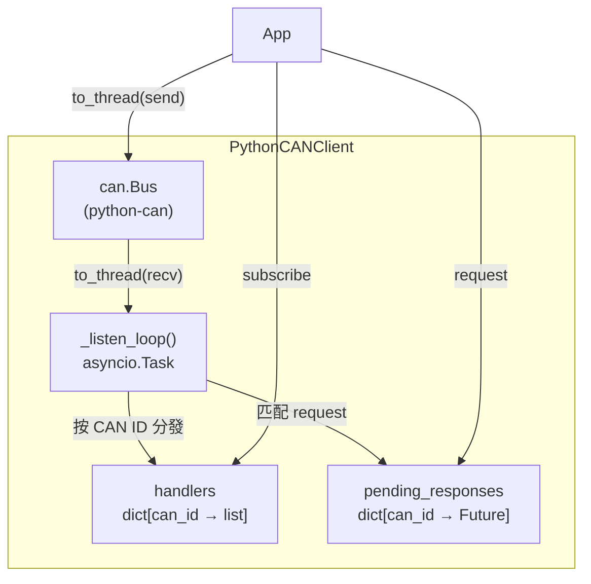

---
tags:
  - type/class
  - layer/can
  - status/complete
source: csp_lib/can/clients/
created: 2026-03-06
updated: 2026-04-04
version: ">=0.4.2"
---

# CAN Clients

> CAN Bus 非同步客戶端

---

## AsyncCANClientBase（ABC）

所有 CAN 客戶端必須實作的抽象介面。

```python
from csp_lib.can.clients.base import AsyncCANClientBase
```

### 介面方法

| 分類 | 方法 | 說明 |
|------|------|------|
| **連線管理** | `connect()` | 建立連線 |
| | `disconnect()` | 斷開連線 |
| | `is_connected()` | 檢查是否已連線 |
| **被動監聽** | `start_listener()` | 啟動背景接收 |
| | `stop_listener()` | 停止背景接收 |
| | `subscribe(can_id, handler)` | 訂閱指定 CAN ID，回傳取消函數 |
| **主動發送** | `send(can_id, data)` | 發送 CAN 訊框 |
| **請求-回應** | `request(can_id, data, response_id, timeout)` | 發送並等回應 |

---

## PythonCANClient

基於 [python-can](https://python-can.readthedocs.io/) 的實作。

```python
from csp_lib.can import PythonCANClient, CANBusConfig

client = PythonCANClient(CANBusConfig(
    interface="socketcan",
    channel="can0",
))
```

### 完整使用範例

```python
# 1. 連線
await client.connect()
await client.start_listener()

# 2. 被動監聽
def on_bms(frame):
    print(f"BMS: {frame.data.hex()}")

cancel = client.subscribe(0x100, on_bms)

# 3. 主動發送
await client.send(0x200, b"\x88\x13\x00\x00\x00\x00\x00\x00")

# 4. 請求-回應
response = await client.request(
    can_id=0x300,
    data=b"\x01",
    response_id=0x301,
    timeout=1.0,
)

# 5. 清理
cancel()  # 取消訂閱
await client.stop_listener()
await client.disconnect()
```

### 內部機制



- 所有阻塞 I/O（`recv()`、`send()`）都透過 `asyncio.to_thread()` 避免阻塞事件迴圈
- 背景 listener task 持續接收，按 CAN ID 分發到 handlers
- `request()` 使用 `asyncio.Future` 實現請求-回應配對

---

## 相關頁面

- [[CAN Configuration]] — CANBusConfig 設定
- [[CAN Exceptions]] — 錯誤處理
- [[AsyncCANDevice]] — 使用客戶端的設備類別
- [[_MOC CAN]] — CAN 模組總覽
