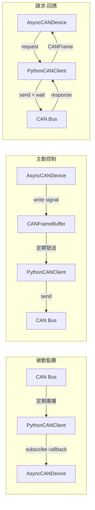

---
tags:
  - type/moc
  - layer/can
  - status/complete
source: csp_lib/can/
created: 2026-03-06
updated: 2026-04-04
version: ">=0.4.2"
---

# _MOC CAN

## CAN Bus 協議層 (`csp_lib.can`)

> [!info] 安裝
> 需安裝：`pip install csp0924_lib[can]`

提供 CAN Bus 非同步通訊，基於 python-can 統一抽象。支援 SocketCAN (Linux)、CAN-over-TCP 閘道器、虛擬介面等。此模組與 [[_MOC Modbus]] 平行，同為 Layer 2 協議層。

---

## 頁面索引

| 頁面 | 說明 |
|------|------|
| [[CAN Configuration]] | 連線設定類別（CANBusConfig、CANFrame） |
| [[CAN Clients]] | 非同步客戶端（AsyncCANClientBase、PythonCANClient） |
| [[CAN Exceptions]] | 例外類別階層 |

---

## 模組架構

```
csp_lib.can
├── config.py          # CANBusConfig, CANFrame
├── exceptions.py      # CANError 例外樹
└── clients/
    ├── base.py        # AsyncCANClientBase (ABC)
    └── python_can.py  # PythonCANClient (python-can 實作)
```

---

## CAN vs Modbus 比較

| 特性 | Modbus (TCP/RTU) | CAN Bus |
|------|-----------------|---------|
| 通訊模型 | 主從輪詢（request-response） | 事件驅動（broadcast + request-response） |
| 資料單位 | 16-bit 暫存器 | 8-byte 訊框（bit-level 信號） |
| 定址方式 | Unit ID + Register Address | CAN ID (11-bit/29-bit) |
| 寫入語意 | 直接寫暫存器 | Read-Modify-Write（Frame Buffer） |
| 典型場景 | PCS / 電表 / PLC | BMS / EMS CAN 閘道器 |

---

## 三種操作模式



---

## Dataview

```dataview
TABLE WITHOUT ID
  file.link AS "頁面",
  tags AS "標籤"
FROM "03-CAN"
WHERE file.name != "_MOC CAN"
SORT file.name ASC
```

---

## 相關模組

| 方向 | 模組 |
|------|------|
| 上游 | [[_MOC Core]] — 核心生命週期與基礎工具 |
| 平行 | [[_MOC Modbus]] — Modbus TCP/RTU 協議層 |
| 下游 | [[_MOC Equipment]] — 設備抽象層，CAN 與 Modbus 設備共存 |
