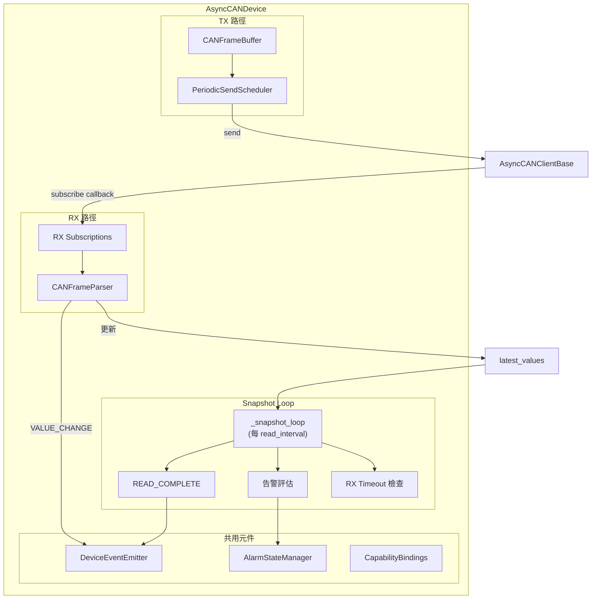

---
tags:
  - type/class
  - layer/equipment
  - status/complete
source: csp_lib/equipment/device/can_device.py
created: 2026-03-06
updated: 2026-04-16
version: ">=0.7.2"
---

# AsyncCANDevice

> CAN Bus 設備類別

`AsyncCANDevice` 是 CAN Bus 設備的完整抽象，與 [[AsyncModbusDevice]] 平行。整合 Frame Buffer (TX)、接收解析 (RX)、Snapshot Loop、RX Timeout 斷線偵測、事件系統與告警管理。透過 [[DeviceProtocol]] 與 Modbus 設備共用上層（Controller / Manager / Integration）。

---

## 建構參數

```python
from csp_lib.equipment.device import AsyncCANDevice, DeviceConfig
from csp_lib.equipment.device.can_device import CANRxFrameDefinition
from csp_lib.equipment.processing.can_encoder import CANSignalDefinition, FrameBufferConfig
from csp_lib.equipment.transport.periodic_sender import PeriodicFrameConfig
from csp_lib.can import PythonCANClient, CANBusConfig

device = AsyncCANDevice(
    config=DeviceConfig(device_id="pcs_001", read_interval=1.0),
    client=PythonCANClient(CANBusConfig(interface="socketcan", channel="can0")),
    # TX 配置
    tx_signals=[...],
    tx_buffer_configs=[FrameBufferConfig(can_id=0x200)],
    tx_periodic_configs=[PeriodicFrameConfig(can_id=0x200, interval=0.1)],
    # RX 配置
    rx_frame_definitions=[CANRxFrameDefinition(can_id=0x100, parser=bms_parser)],
    # 通用
    alarm_evaluators=[...],
    aggregator_pipeline=None,
    capability_bindings=[...],
    rx_timeout=10.0,
)
```

| 參數 | 型別 | 預設 | 說明 |
|------|------|------|------|
| `config` | `DeviceConfig` | — | 設備設定（`read_interval` 控制 snapshot 週期，詳見 [[DeviceConfig]]） |
| `client` | `AsyncCANClientBase` | — | CAN 客戶端（詳見 [[CAN Clients]]） |
| `tx_signals` | `Sequence[CANSignalDefinition]` | `()` | 發送信號定義 |
| `tx_buffer_configs` | `Sequence[FrameBufferConfig]` | `()` | Frame Buffer 配置 |
| `tx_periodic_configs` | `Sequence[PeriodicFrameConfig]` | `()` | 定期發送配置 |
| `rx_frame_definitions` | `Sequence[CANRxFrameDefinition]` | `()` | 接收訊框定義 |
| `alarm_evaluators` | `Sequence[AlarmEvaluator]` | `()` | 告警評估器 |
| `aggregator_pipeline` | `AggregatorPipeline \| None` | `None` | 聚合器管線 |
| `capability_bindings` | `Sequence[CapabilityBinding]` | `()` | 能力綁定 |
| `rx_timeout` | `float` | `10.0` | RX 超時秒數，超過後視為斷線 |

---

## 三種操作模式

| 模式 | 配置方式 | 行為 |
|------|---------|------|
| **被動監聽** | `rx_frame_definitions` 中 `is_periodic=True` | `connect()` 時訂閱回調，收到訊框即解碼更新 `latest_values` |
| **主動控制** | `tx_signals` + `tx_periodic_configs` | `write()` 更新 buffer，定期/立即發送 |
| **請求-回應** | `rx_frame_definitions` 中 `is_periodic=False` | `read_once()` 時發送請求，等回應後解碼 |

---

## 生命週期

### Context Manager（推薦）

```python
async with device:
    ...  # auto connect + start, auto stop + disconnect
```

### 手動管理

```python
await device.connect()    # 連線 + 啟動 listener + 訂閱 RX
await device.start()      # 啟動定期發送 + snapshot loop
...
await device.stop()       # 停止定期發送 + snapshot loop
await device.disconnect() # 取消訂閱 + 停止 listener + 斷線
```

| 方法 | 說明 |
|------|------|
| `connect()` | 連線 CAN Bus，啟動 listener，訂閱 RX 訊框 |
| `start()` | 啟動定期發送排程器 + snapshot loop |
| `stop()` | 停止定期發送排程器 + snapshot loop |
| `disconnect()` | 取消 RX 訂閱，停止 listener，斷開連線 |
| `read_once()` | 返回 latest_values + 處理請求-回應訊框（不發射 `READ_COMPLETE`） |

---

## Snapshot Loop 與事件頻率控制

### 問題

CAN RX 每次收到訊框（可達 ~100Hz）都直接發射事件，會壓垮下游消費者（DataUploadManager、GUI WebSocket 等）。

### 解法

`_snapshot_loop` 按 `config.read_interval` 週期執行，與 Modbus `AsyncModbusDevice._read_loop` 對齊（v0.7.2 起使用絕對時間錨定，詳見下方說明）：

```
每個 read_interval:
  1. 發射 READ_COMPLETE（完整 latest_values 快照）
  2. 執行告警評估（_evaluate_alarm）
  3. 檢查 RX timeout（_check_rx_timeout）
```

### 事件流對比

```
Modbus:  _read_loop (每 read_interval) → read registers → READ_COMPLETE + VALUE_CHANGE + alarms
CAN:     RX callback (每次收到訊框)    → VALUE_CHANGE only
         _snapshot_loop (每 read_interval) → READ_COMPLETE + alarms + timeout check
```

> [!important] 事件語意差異
> - **`VALUE_CHANGE`**：由 RX 回調即時發射，僅在值實際變化時觸發
> - **`READ_COMPLETE`**：由 snapshot loop 週期性發射，包含完整快照，頻率 = `1 / read_interval`

> [!note] v0.7.2 絕對時間錨定（WI-TD-101）
> `_snapshot_loop` 改採 work-first 絕對時間錨定（`next_tick_delay()`），sleep delay 補償 work 耗時，消除累積時序漂移。落後超過一個 interval 時自動重設 anchor，避免 burst catch-up。修復前 interval=0.1s, work=0.02s 情境下 1 小時可漂移 720s。

---

## RX Timeout 斷線偵測

CAN 設備不像 Modbus 有請求-回應機制，當對端停止廣播時，沒有主動的錯誤回報。`rx_timeout` 提供被動的斷線偵測。

### 運作機制

| 狀態 | 條件 | 動作 |
|------|------|------|
| **超時** | `now - _last_rx_time > rx_timeout` 且 `is_responsive=True` | 設為 `is_responsive=False`，發射 `DISCONNECTED`（reason=`"rx_timeout"`） |
| **恢復** | 收到任意 RX 訊框 且 `is_responsive=False` | 設為 `is_responsive=True`，發射 `CONNECTED` |

- `_last_rx_time` 在每次 `_process_rx_frame()` 時更新
- 超時檢查在 `_snapshot_loop` 中每個 `read_interval` 週期執行
- `connect()` 時初始化 `_last_rx_time`，避免啟動後立即誤判

### 參數選擇建議

| 場景 | `rx_timeout` 建議值 |
|------|---------------------|
| 高頻 BMS 廣播（10-100Hz） | 2-5 秒 |
| 低頻監控訊號（1Hz） | 10-30 秒 |
| 偶發狀態回報 | 60+ 秒 |

---

## 寫入語意

```python
# 預設：只更新 buffer，等待定期發送
await device.write("power_target", 5000)

# 立即發送：更新 buffer 後立即發送整個訊框
await device.write("start_stop", 1, immediate=True)
```

> [!important] Read-Modify-Write
> 寫入一個信號時，只修改該信號的 bit 範圍，同一訊框中的其他信號不受影響。這是透過 [[CANEncoder|CANFrameBuffer]] 的位元遮罩操作實現的。

---

## 狀態屬性

| 屬性 | 型別 | 說明 |
|------|------|------|
| `device_id` | `str` | 設備 ID |
| `is_connected` | `bool` | CAN Bus 連線狀態 |
| `is_responsive` | `bool` | 設備通訊回應狀態（受 RX timeout 控制） |
| `is_protected` | `bool` | 是否有保護告警 |
| `latest_values` | `dict` | 最新接收值字典 |
| `active_alarms` | `list` | 目前啟用的告警列表 |
| `capabilities` | `dict` | 已綁定的能力 |

---

## 事件系統

與 [[AsyncModbusDevice]] 共用相同的事件系統（[[DeviceEventEmitter]]）：

| 事件名稱 | Payload | 觸發來源 | 說明 |
|---------|---------|---------|------|
| `connected` | `ConnectedPayload` | `connect()` / RX 恢復 | 連線成功或 timeout 恢復 |
| `disconnected` | `DisconnectPayload` | `disconnect()` / RX timeout | 斷線或 timeout 偵測 |
| `read_complete` | `ReadCompletePayload` | `_snapshot_loop` | 週期性快照（非每次 RX） |
| `value_change` | `ValueChangePayload` | `_process_rx_frame` | 值變化（RX 收到新值） |
| `write_complete` | `WriteCompletePayload` | `write()` | 寫入成功 |
| `write_error` | `WriteErrorPayload` | `write()` | 寫入失敗 |
| `alarm_triggered` | `DeviceAlarmPayload` | `_snapshot_loop` | 告警觸發 |
| `alarm_cleared` | `DeviceAlarmPayload` | `_snapshot_loop` / `clear_alarm()` | 告警解除 |

---

## 內部架構



---

## CANRxFrameDefinition

```python
@dataclass(frozen=True)
class CANRxFrameDefinition:
    can_id: int                     # 要監聽的 CAN ID
    parser: CANFrameParser          # 訊框解析器
    is_periodic: bool = True        # True=被動監聽, False=請求-回應
    request_data: bytes = b""       # 請求資料（僅 is_periodic=False）
```

---

## 完整使用範例

```python
from csp_lib.can import PythonCANClient, CANBusConfig
from csp_lib.equipment.device import AsyncCANDevice, DeviceConfig
from csp_lib.equipment.device.can_device import CANRxFrameDefinition
from csp_lib.equipment.processing import CANField, CANFrameParser, CANSignalDefinition, FrameBufferConfig
from csp_lib.equipment.transport import PeriodicFrameConfig

# RX: BMS 監聽
bms_parser = CANFrameParser(
    source_name="bms_0x100",
    fields=[
        CANField("soc", 0, 8, resolution=0.4, decimals=1),
        CANField("voltage", 8, 16, resolution=0.1, decimals=1),
        CANField("temperature", 40, 8, offset=-40.0, as_int=True),
    ],
)

# TX: PCS 控制
pcs_signals = [
    CANSignalDefinition(0x200, CANField("power_target", 0, 16, resolution=1.0)),
    CANSignalDefinition(0x200, CANField("start_stop", 20, 1, resolution=1.0)),
]

client = PythonCANClient(CANBusConfig(interface="socketcan", channel="can0"))

async with AsyncCANDevice(
    config=DeviceConfig(device_id="pcs_001", read_interval=1.0),
    client=client,
    tx_signals=pcs_signals,
    tx_buffer_configs=[FrameBufferConfig(can_id=0x200)],
    tx_periodic_configs=[PeriodicFrameConfig(can_id=0x200, interval=0.1)],
    rx_frame_definitions=[CANRxFrameDefinition(can_id=0x100, parser=bms_parser)],
    rx_timeout=5.0,  # BMS 高頻廣播，5 秒無回應視為斷線
) as device:
    await device.write("power_target", 5000)
    await device.write("start_stop", 1, immediate=True)
    print(device.latest_values)  # {"soc": 85.2, "voltage": 380.5, ...}
```

---

## 相關頁面

- [[DeviceProtocol]] — 設備通用協定
- [[AsyncModbusDevice]] — Modbus 設備（平行實作）
- [[CANEncoder]] — 信號編碼與 Frame Buffer
- [[PeriodicSendScheduler]] — 定期發送排程器
- [[CAN Clients]] — CAN 客戶端
- [[DeviceEventEmitter]] — 事件系統
- [[_MOC Equipment]] — 設備模組總覽
