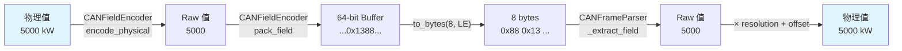

---
tags:
  - type/class
  - layer/equipment
  - status/complete
source: csp_lib/equipment/processing/can_encoder.py
created: 2026-03-06
updated: 2026-04-04
version: ">=0.4.2"
---

# CANEncoder

> CAN 信號編碼器與 Frame Buffer

提供 CAN 訊框的編碼路徑，與既有的 [[ProcessingPipeline|CANFrameParser]]（解碼方向）對稱。核心元件包括 `CANFieldEncoder`（位元編碼）和 `CANFrameBuffer`（狀態緩衝）。

---

## CANSignalDefinition

擴展 `CANField` 加上所屬的 CAN ID，用於發送方向。

```python
from csp_lib.equipment.processing import CANSignalDefinition, CANField

signal = CANSignalDefinition(
    can_id=0x200,
    field=CANField("power_target", 0, 16, resolution=1.0),
    min_raw=0,        # 原始值下限（可選）
    max_raw=10000,    # 原始值上限（可選）
)
```

| 參數 | 型別 | 預設值 | 說明 |
|------|------|--------|------|
| `can_id` | `int` | *必填* | CAN 訊框 ID |
| `field` | `CANField` | *必填* | 復用既有的 CANField |
| `min_raw` | `int \| None` | `None` | 原始值下限 |
| `max_raw` | `int \| None` | `None` | 原始值上限 |

---

## CANFieldEncoder

`CANFrameParser._extract_field` 的逆運算。

### encode_physical

```python
from csp_lib.equipment.processing.can_encoder import CANFieldEncoder

# 物理值 → raw 值
raw = CANFieldEncoder.encode_physical(signal, 5000)
# raw = round((5000 - offset) / resolution) = 5000
```

公式：`raw = round((physical - offset) / resolution)`，結果 clamp 到 `[0, 2^bit_length - 1]`。

### pack_field

```python
# Read-Modify-Write: 只改目標 bit 範圍
buffer_int = CANFieldEncoder.pack_field(buffer_int, signal, raw_value)
```

位元操作機制：
1. 建立 bitmask：`mask = (1 << bit_length) - 1`
2. 清除目標位元：`buffer &= ~(mask << start_bit)`
3. 寫入新值：`buffer |= (raw & mask) << start_bit`

---

## FrameBufferConfig

```python
from csp_lib.equipment.processing import FrameBufferConfig

config = FrameBufferConfig(
    can_id=0x200,
    initial_data=b"\x00" * 8,  # 初始 8 bytes（預設全零）
)
```

---

## CANFrameBuffer

核心狀態緩衝，為每個發送用 CAN ID 維護 8-byte 緩衝區。Thread-safe。

```python
from csp_lib.equipment.processing import CANFrameBuffer, CANSignalDefinition, FrameBufferConfig, CANField

buffer = CANFrameBuffer(
    configs=[FrameBufferConfig(can_id=0x200)],
    signals=[
        CANSignalDefinition(0x200, CANField("power_target", 0, 16, resolution=1.0)),
        CANSignalDefinition(0x200, CANField("mode", 16, 4, resolution=1.0)),
        CANSignalDefinition(0x200, CANField("start_stop", 20, 1, resolution=1.0)),
    ],
)

# 寫入信號（只改指定 bit，其他不變）
buffer.set_signal("power_target", 5000)   # bit 0-15
buffer.set_signal("mode", 3)             # bit 16-19
buffer.set_signal("start_stop", 1)       # bit 20

# 取得完整訊框
frame = buffer.get_frame(0x200)  # 8 bytes
```

### 方法

| 方法 | 說明 |
|------|------|
| `set_signal(name, physical_value)` | 設定物理值（自動編碼 + pack） |
| `set_raw(name, raw_value)` | 直接設定原始值 |
| `get_frame(can_id)` | 取得 8 bytes 訊框資料 |
| `get_signal(name)` | 取得信號定義 |

### 位元操作示意

```
CAN ID 0x200 — 8 bytes (64 bits)
┌─────────────────┬──────────┬───┬──────────────────────┐
│ bit 0-15        │ bit 16-19│b20│ bit 21-63 (保留)      │
│ power_target    │ mode     │s/s│                       │
└─────────────────┴──────────┴───┴──────────────────────┘

set_signal("power_target", 5000):
  → 只清除 bit 0-15，寫入 5000
  → mode (bit 16-19) 和 start_stop (bit 20) 不受影響

set_signal("start_stop", 1):
  → 只清除 bit 20，寫入 1
  → power_target 和 mode 不受影響
```

---

## 編碼-解碼對稱性



---

## 相關頁面

- [[AsyncCANDevice]] — 使用 FrameBuffer 的設備類別
- [[PeriodicSendScheduler]] — 從 Buffer 取資料定期發送
- [[Aggregators]] — 既有的 CANFrameParser（解碼方向）
- [[_MOC Equipment]] — 設備模組總覽
