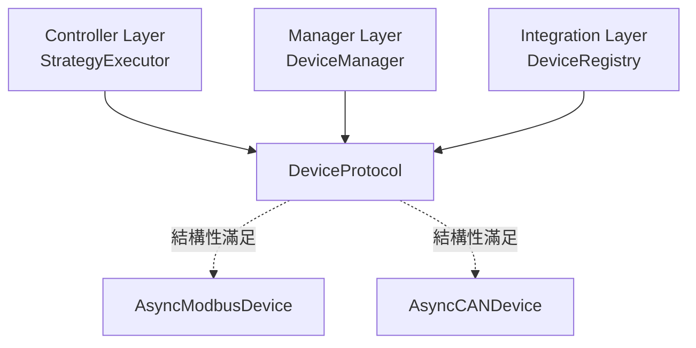

---
tags:
  - type/class
  - layer/equipment
  - status/complete
source: csp_lib/equipment/device/protocol.py
created: 2026-03-06
updated: 2026-04-04
version: ">=0.4.2"
---

# DeviceProtocol

> 設備通用協定

`DeviceProtocol` 定義了所有設備類型的最小公開介面，使用 `@runtime_checkable` 裝飾器，支援 `isinstance()` 檢查。[[AsyncModbusDevice]] 和 [[AsyncCANDevice]] 均**無需修改**即可結構性滿足此協定。

---

## 協定定義

```python
from csp_lib.equipment.device import DeviceProtocol

@runtime_checkable
class DeviceProtocol(Protocol):
    @property
    def device_id(self) -> str: ...

    @property
    def is_connected(self) -> bool: ...

    @property
    def is_responsive(self) -> bool: ...

    @property
    def latest_values(self) -> dict[str, Any]: ...

    @property
    def is_protected(self) -> bool: ...

    @property
    def active_alarms(self) -> list[AlarmState]: ...

    async def read_once(self) -> dict[str, Any]: ...

    async def write(self, name: str, value: Any, **kwargs) -> WriteResult: ...

    def on(self, event: str, handler: AsyncHandler) -> Callable[[], None]: ...

    def health(self) -> HealthReport: ...
```

---

## 結構性滿足

| 方法/屬性 | AsyncModbusDevice | AsyncCANDevice |
|-----------|:-:|:-:|
| `device_id` | ✓ | ✓ |
| `is_connected` | ✓ | ✓ |
| `is_responsive` | ✓ | ✓ |
| `latest_values` | ✓ | ✓ |
| `is_protected` | ✓（AlarmMixin） | ✓（AlarmMixin） |
| `active_alarms` | ✓（AlarmMixin） | ✓（AlarmMixin） |
| `read_once()` | ✓ | ✓ |
| `write()` | ✓（WriteMixin） | ✓（自行實作） |
| `on()` | ✓ | ✓ |
| `health()` | ✓ | ✓ |

```python
# isinstance 檢查
assert isinstance(modbus_device, DeviceProtocol)  # True
assert isinstance(can_device, DeviceProtocol)      # True
```

---

## 上層使用方式

上層（L4-L6）可以統一使用 `DeviceProtocol` 操作任何設備：

```python
async def monitor_device(device: DeviceProtocol) -> None:
    """統一的設備監控邏輯，不關心底層協議"""
    values = device.latest_values
    report = device.health()

    if device.is_protected:
        print(f"[{device.device_id}] 設備保護中，告警數: {len(device.active_alarms)}")

    device.on("value_change", on_value_change)
```



---

## 相關頁面

- [[AsyncModbusDevice]] — Modbus 設備實作
- [[AsyncCANDevice]] — CAN 設備實作
- [[_MOC Equipment]] — 設備模組總覽
