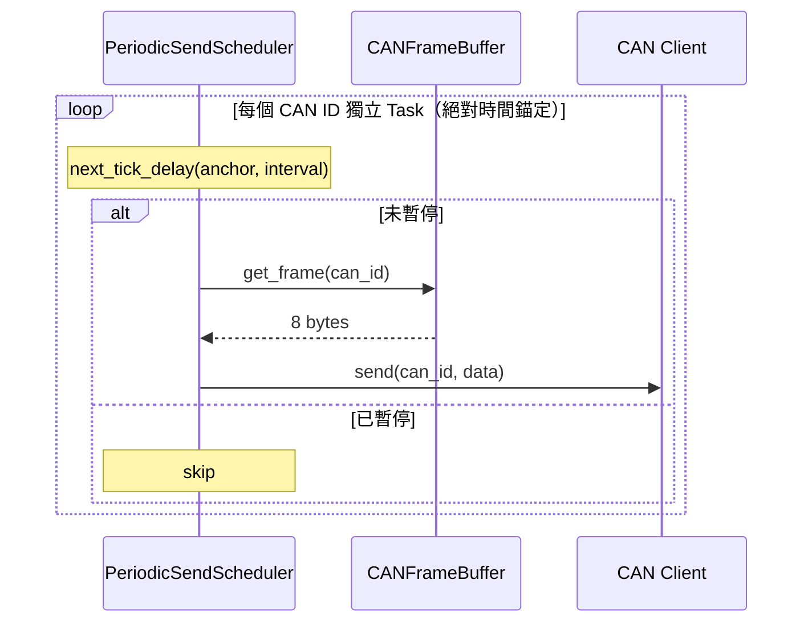

---
tags:
  - type/class
  - layer/equipment
  - status/complete
source: csp_lib/equipment/transport/periodic_sender.py
created: 2026-03-06
updated: 2026-04-16
version: ">=0.7.2"
---

# PeriodicSendScheduler

> CAN 定期發送排程器

為每個 CAN ID 建立獨立的 `asyncio.Task`，按設定的週期從 [[CANEncoder|CANFrameBuffer]] 取得最新內容並發送。支持暫停/恢復/立即發送。

---

## PeriodicFrameConfig

```python
from csp_lib.equipment.transport import PeriodicFrameConfig

config = PeriodicFrameConfig(
    can_id=0x200,
    interval=0.1,    # 100ms
    enabled=True,
)
```

| 參數 | 型別 | 預設值 | 說明 |
|------|------|--------|------|
| `can_id` | `int` | *必填* | CAN 訊框 ID |
| `interval` | `float` | `0.1` | 發送間隔（秒） |
| `enabled` | `bool` | `True` | 是否啟用 |

---

## 使用方式

```python
from csp_lib.equipment.transport import PeriodicSendScheduler, PeriodicFrameConfig

scheduler = PeriodicSendScheduler(
    frame_buffer=buffer,          # CANFrameBuffer 實例
    send_callback=client.send,    # async def send(can_id, data)
    configs=[
        PeriodicFrameConfig(can_id=0x200, interval=0.1),   # PCS 控制 100ms
        PeriodicFrameConfig(can_id=0x300, interval=0.5),   # 心跳 500ms
    ],
)

await scheduler.start()

# 暫停/恢復特定 CAN ID
scheduler.pause(0x200)
scheduler.resume(0x200)

# 立即發送（不等週期）
await scheduler.send_now(0x200)

await scheduler.stop()
```

---

## 方法

| 方法 | 說明 |
|------|------|
| `start()` | 啟動所有定期發送任務 |
| `stop()` | 停止所有定期發送任務 |
| `pause(can_id)` | 暫停指定 CAN ID 的定期發送 |
| `resume(can_id)` | 恢復指定 CAN ID 的定期發送 |
| `send_now(can_id)` | 立即發送指定 CAN ID 的訊框 |

---

## 內部機制



每個 CAN ID 建立一個獨立的 `asyncio.Task`，互不影響。發送失敗時記錄日誌並重新錨定，繼續下一個週期。

> [!note] v0.7.2 絕對時間錨定（WI-TD-102）
> `_send_loop` 改採 work-first 絕對時間錨定（`next_tick_delay()`），sleep delay 補償 `send_callback` 耗時。
> - 修復前（`asyncio.sleep(interval)`）：每次迴圈固定 sleep interval 秒，work 耗時累積後產生漂移（interval=0.1s, work=0.02s → 1 小時漂移 720s）
> - 修復後：實際 sleep = `interval - elapsed`，時序嚴格對齊絕對時間戳
> - 落後超過一個 interval 時自動重設 anchor，避免 burst catch-up 壓垮設備
> - Exception 路徑保留固定 `sleep(interval)` 並重新錨定，避免緊迴圈

---

## 相關頁面

- [[CANEncoder]] — CANFrameBuffer（資料來源）
- [[AsyncCANDevice]] — 整合使用 PeriodicSendScheduler
- [[_MOC Equipment]] — 設備模組總覽
