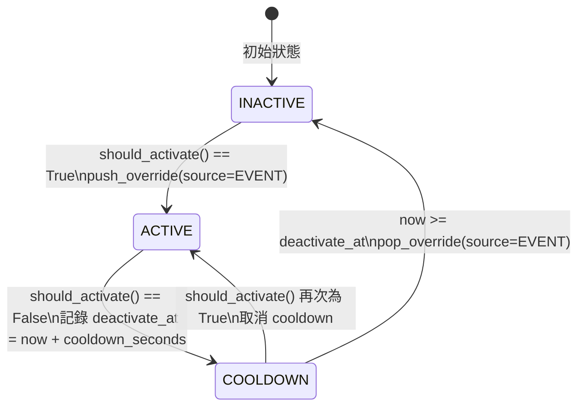

---
tags:
  - type/protocol
  - layer/controller
  - status/complete
source: csp_lib/controller/system/event_override.py
created: 2026-03-06
updated: 2026-04-04
version: ">=0.4.2"
---

# EventDrivenOverride

系統事件驅動的自動模式 Override 協定與內建實現。

> [!info] 回到 [[_MOC Controller]]

## 概述

在 v0.4.2 之前，系統遇到告警時的自動停機邏輯是在 `SystemController._handle_auto_stop()` 中**硬編碼**的。這意味著：

- 無法自訂觸發條件（只支援 `system_alarm`）
- 無法重用相同機制處理其他系統事件（如 ACB 跳脫、頻率偏差）
- 測試困難，邏輯散落在 `SystemController` 內部

`EventDrivenOverride` 協定解決了**系統事件 → 自動模式切換**這個缺口，讓任何可由 `StrategyContext` 觀察到的條件都能自動觸發 `push_override` / `pop_override`。

### 三種模式切換來源

模式切換在 `ModeManager` 中以 `SwitchSource` 記錄來源，三種來源彼此**正交**，互不干擾：

| 來源 | `SwitchSource` | 典型觸發者 | 說明 |
|------|---------------|-----------|------|
| 手動 | `MANUAL` | 操作員 UI / API | 優先權最高的人工干預 |
| 排程 | `SCHEDULE` | `ScheduleStrategy` | 時間表驅動的計畫性切換 |
| 事件 | `EVENT` | `EventDrivenOverride` | 由即時感測值或系統事件觸發 |
| 內部 | `INTERNAL` | 框架內部 | 啟動/關閉等生命週期動作 |

`ExecutionMode`（PERIODIC / TRIGGERED / HYBRID）描述**策略如何執行**，與 `SwitchSource` 描述**模式如何切換**完全分離，不要混淆。

---

## SwitchSource

```python
from csp_lib.controller.system.mode import SwitchSource

class SwitchSource(Enum):
    MANUAL   = "manual"
    SCHEDULE = "schedule"
    EVENT    = "event"
    INTERNAL = "internal"
```

`SwitchSource` 主要用於**審計追蹤**。`ModeManager.last_switch_source` 屬性記錄最近一次切換的來源，便於日誌分析與事後排查。

---

## Protocol 定義

```python
from csp_lib.controller.system.event_override import EventDrivenOverride
from csp_lib.controller.core import StrategyContext

@runtime_checkable
class EventDrivenOverride(Protocol):
    @property
    def name(self) -> str:
        """對應 ModeManager 中已註冊的模式名稱"""
        ...

    @property
    def cooldown_seconds(self) -> float:
        """條件解除後的冷卻時間（秒），防止頻繁抖動"""
        ...

    def should_activate(self, context: StrategyContext) -> bool:
        """評估是否應啟用此 override（同步，每個執行週期呼叫）"""
        ...
```

### 協定成員說明

| 成員 | 型別 | 說明 |
|------|------|------|
| `name` | `str` (property) | 必須與已在 `ModeManager` 中 `register()` 的模式名稱一致 |
| `cooldown_seconds` | `float` (property) | 條件轉為 `False` 後，等待此秒數再執行 `pop_override`（防抖） |
| `should_activate(context)` | `bool` | 從 `StrategyContext` 讀取感測值並決定是否啟用 |

> [!tip] Protocol 是 `@runtime_checkable`
> 可使用 `isinstance(obj, EventDrivenOverride)` 在執行期驗證相容性，適合用於框架內部的動態派發。

---

## 內建實現

### AlarmStopOverride

告警自動停機，取代舊版硬編碼的 `_handle_auto_stop()`。

```python
from csp_lib.controller.system.event_override import AlarmStopOverride

class AlarmStopOverride:
    def __init__(
        self,
        name: str = "__auto_stop__",
        alarm_key: str = "system_alarm",
    ) -> None: ...
```

| 參數 | 預設值 | 說明 |
|------|--------|------|
| `name` | `"__auto_stop__"` | 對應 ModeManager 中的 Stop 模式名稱 |
| `alarm_key` | `"system_alarm"` | 在 `context.extra` 中讀取告警旗標的 key |

**行為**：當 `context.extra[alarm_key] is True` 時啟動 override；條件解除後立即（`cooldown_seconds=0.0`）pop override。

---

### ContextKeyOverride

通用事件驅動 override，根據 `context.extra` 中任意 key 的值決定是否啟用。

```python
from csp_lib.controller.system.event_override import ContextKeyOverride

class ContextKeyOverride:
    def __init__(
        self,
        name: str,
        context_key: str,
        activate_when: Callable[[Any], bool],
        cooldown_seconds: float = 5.0,
    ) -> None: ...
```

| 參數 | 型別 | 說明 |
|------|------|------|
| `name` | `str` | 對應 ModeManager 中已註冊的模式名稱 |
| `context_key` | `str` | 在 `context.extra` 中讀取的 key |
| `activate_when` | `Callable[[Any], bool]` | 接收 key 對應的值，返回 `True` 表示應啟用 |
| `cooldown_seconds` | `float` | 條件解除後的冷卻秒數（預設 5.0） |

**行為**：當 `context.extra[context_key]` 不存在時視為 `False`（不啟用）。

---

## SystemController 評估流程

`SystemController` 在每個命令週期的 `_on_command()` 中呼叫 `_evaluate_event_overrides()`，統一評估所有已註冊的 `EventDrivenOverride`。

### 評估邏輯（狀態機）



### Cooldown 機制

| 狀態 | `should_activate()` | 行為 |
|------|---------------------|------|
| INACTIVE → ACTIVE | `True` | 立即 `push_override`，記錄 `state.active = True` |
| ACTIVE（持續中） | `True` | 無操作（防止重複 push） |
| ACTIVE → COOLDOWN | `False` | 記錄 `deactivate_at = now + cooldown_seconds` |
| COOLDOWN（等待中） | `False` | 等待 cooldown 到期後執行 `pop_override` |
| COOLDOWN → ACTIVE | `True` | 取消 cooldown（`deactivate_at = None`），保持 override 活躍 |

Cooldown 設計用於**防止抖動**：當感測值在閾值附近震盪時，避免 override 被反覆 push/pop。

---

## 使用範例

### ACB 跳脫 → 自動進入離網模式

```python
from csp_lib.controller.system.event_override import ContextKeyOverride
from csp_lib.controller import ModePriority
from csp_lib.controller.strategies import IslandModeStrategy

# 1. 註冊離網模式
controller.register_mode(
    "islanding",
    IslandModeStrategy(...),
    priority=ModePriority.PROTECTION,
    description="ACB trip islanding mode",
)

# 2. 建立事件驅動 override：ACB 跳脫（acb_trip=True）→ 進入離網
acb_override = ContextKeyOverride(
    name="islanding",
    context_key="acb_trip",
    activate_when=lambda v: v is True,
    cooldown_seconds=10.0,  # ACB 復電後等 10 秒再離開離網模式
)

# 3. 向 SystemController 註冊
controller.register_event_override(acb_override)

# 之後：ContextBuilder 需將 ACB 狀態注入 context.extra["acb_trip"]
# 每個執行週期 SystemController 會自動評估並切換模式
```

### 自訂告警停機條件

```python
from csp_lib.controller.system.event_override import AlarmStopOverride

# 使用自訂 alarm_key（非預設的 "system_alarm"）
custom_stop = AlarmStopOverride(
    name="__auto_stop__",
    alarm_key="critical_fault",  # ContextBuilder 注入的自訂告警 key
)
controller.register_event_override(custom_stop)
```

---

## 遷移說明：_handle_auto_stop 的變更

> [!warning] 向後相容變更
> `_handle_auto_stop()` 在 v0.4.2 中已標記為棄用（但保留向後相容），現在內部直接呼叫 `_evaluate_event_overrides()`。

**舊版行為（v0.3.x）**：
- `SystemControllerConfig(auto_stop_on_alarm=True)` 使用硬編碼的 `_handle_auto_stop()` 邏輯
- 無法自訂觸發條件或添加其他事件 override

**新版行為（v0.4.2+）**：
- `auto_stop_on_alarm=True` 時，自動建立並註冊 `AlarmStopOverride(name="__auto_stop__", alarm_key=config.system_alarm_key)`
- `_auto_stop_active` 屬性仍然有效（由 `_evaluate_event_overrides` 內部維護向後相容）
- 可額外呼叫 `register_event_override()` 添加更多事件驅動 override

**行為完全相同**，無需修改現有程式碼。

---

## 相關連結

- [[ModeManager]] — 管理模式堆疊與 push/pop 操作
- [[SystemController]] — 執行 `_evaluate_event_overrides()` 的入口
- [[StrategyContext]] — `should_activate()` 讀取感測值的來源
- [[Strategy]] — Override 對應的策略基底類別
- [[ProtectionGuard]] — 與 EventDrivenOverride 互補的保護機制（命令層面的限制 vs 模式層面的切換）
