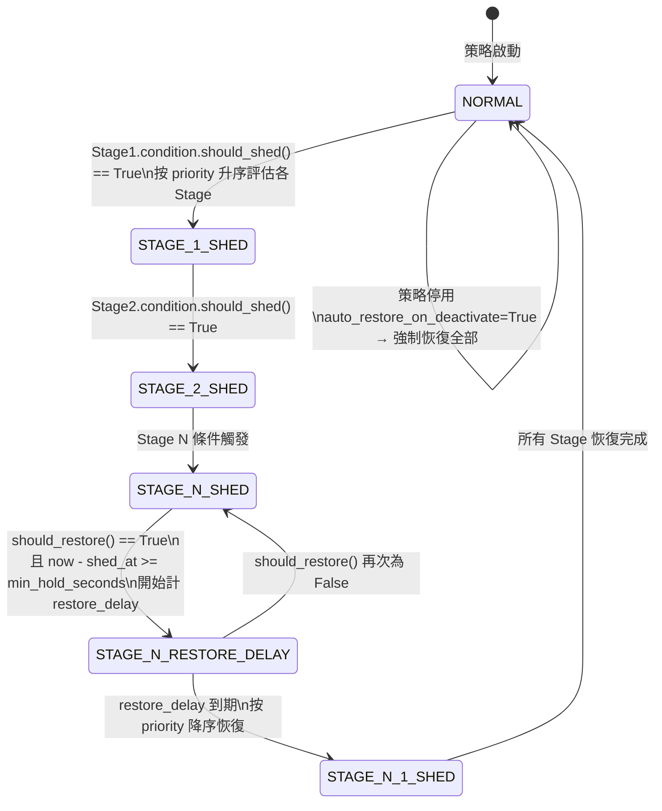
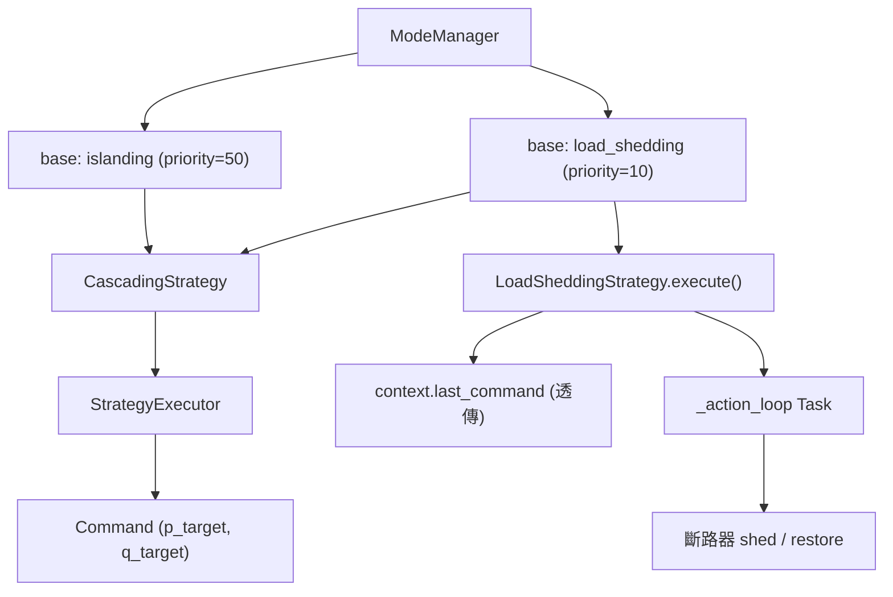

---
tags:
  - type/class
  - layer/controller
  - status/complete
source: csp_lib/controller/strategies/load_shedding.py
created: 2026-03-06
updated: 2026-04-06
version: ">=0.7.1"
---

# LoadSheddingStrategy

階段性負載卸載策略，適用於離網（islanding）等電力供需緊張場景。

> [!info] 回到 [[_MOC Controller]]

## 概述

當系統進入離網模式或電池電量不足時，需要依照優先順序**逐步切斷非關鍵負載**以延長供電時間。`LoadSheddingStrategy` 專門處理此場景。

### 為什麼是獨立策略，而非 IslandModeStrategy 的擴充？

| 設計問題 | 說明 |
|---------|------|
| **職責分離** | `IslandModeStrategy` 負責電壓/頻率的 Grid Forming 控制；負載管理是獨立的業務邏輯層 |
| **非入侵式** | `LoadSheddingStrategy` 直接操控斷路器等外部 `LoadCircuitProtocol` 物件，不干預策略輸出的 `Command`（透傳 `context.last_command`） |
| **可組合性** | 透過 `ModeManager` 的多 base mode 機制，可與 `IslandModeStrategy` 同時運行，互不干擾 |
| **不是 ProtectionRule** | `ProtectionRule` 在命令層面做限幅保護；負載卸載需要控制**實體斷路器**，屬於執行器層面，不適合放在保護鏈中 |

---

## Protocols

### LoadCircuitProtocol

負載迴路控制協定，代表一個可被卸載/恢復的實體電路。

```python
from csp_lib.controller.strategies.load_shedding import LoadCircuitProtocol

@runtime_checkable
class LoadCircuitProtocol(Protocol):
    @property
    def name(self) -> str: ...

    @property
    def is_shed(self) -> bool: ...

    async def shed(self) -> None: ...

    async def restore(self) -> None: ...
```

| 成員 | 型別 | 說明 |
|------|------|------|
| `name` | `str` (property) | 迴路識別名稱（用於日誌） |
| `is_shed` | `bool` (property) | 當前是否處於已卸載狀態 |
| `shed()` | `async method` | 執行卸載（如：開斷斷路器） |
| `restore()` | `async method` | 執行恢復（如：閉合斷路器） |

---

### ShedCondition

卸載觸發條件協定，決定何時應卸載或恢復負載。

```python
from csp_lib.controller.strategies.load_shedding import ShedCondition

@runtime_checkable
class ShedCondition(Protocol):
    def should_shed(self, context: StrategyContext) -> bool: ...

    def should_restore(self, context: StrategyContext) -> bool: ...
```

| 成員 | 型別 | 說明 |
|------|------|------|
| `should_shed(context)` | `bool` | 返回 `True` 時觸發卸載 |
| `should_restore(context)` | `bool` | 返回 `True` 時觸發恢復 |

> [!tip] 遲滯（Hysteresis）設計
> `should_shed` 和 `should_restore` 的閾值應**刻意設計為非對稱**，例如 SOC<20% 才卸載，但 SOC>30% 才恢復。這避免了在臨界值附近的頻繁開關。

---

## 內建條件

### ThresholdCondition

根據 `context.extra` 中某個數值鍵的大小決定卸載/恢復。

```python
from csp_lib.controller.strategies.load_shedding import ThresholdCondition

ThresholdCondition(
    context_key: str,    # context.extra 中的 key
    shed_below: float,   # 低於此值觸發卸載
    restore_above: float # 高於此值觸發恢復（必須 >= shed_below）
)
```

**行為**：

- `context.extra[context_key] < shed_below` → `should_shed()` 返回 `True`
- `context.extra[context_key] > restore_above` → `should_restore()` 返回 `True`
- key 不存在時兩者均返回 `False`（安全預設）

**常見用途**：SOC 百分比閾值。

---

### RemainingTimeCondition

根據電池剩餘時間（分鐘）決定卸載/恢復。

```python
from csp_lib.controller.strategies.load_shedding import RemainingTimeCondition

RemainingTimeCondition(
    context_key: str = "battery_remaining_minutes",
    shed_below: float = 30.0,   # 低於 30 分鐘觸發卸載
    restore_above: float = 45.0 # 高於 45 分鐘觸發恢復
)
```

| 參數 | 型別 | 預設值 | 說明 |
|------|------|--------|------|
| `context_key` | `str` | `"battery_remaining_minutes"` | `context.extra` 中剩餘時間的 key |
| `shed_below` | `float` | `30.0` | 低於此分鐘數觸發卸載 |
| `restore_above` | `float` | `45.0` | 高於此分鐘數觸發恢復 |

---

## ShedStage

卸載階段，將一組負載迴路與觸發條件綁定。

```python
from dataclasses import dataclass
from csp_lib.controller.strategies.load_shedding import ShedStage

@dataclass(frozen=True)
class ShedStage:
    name: str                           # 階段名稱（唯一）
    circuits: list[LoadCircuitProtocol] # 此階段管轄的迴路列表
    condition: ShedCondition            # 觸發條件
    priority: int = 0                   # 越小越優先卸載（越晚恢復）
    min_hold_seconds: float = 30.0      # 最小保持時間（秒），防止卸載後立即恢復
```

| 欄位 | 說明 |
|------|------|
| `name` | 階段識別名稱，用於日誌和狀態查詢 |
| `circuits` | 此階段觸發時同時操控的所有迴路 |
| `condition` | 決定何時 shed / restore 的條件實例 |
| `priority` | **數值越小越先卸載**（越晚恢復）；`priority=0` 的最先被切 |
| `min_hold_seconds` | 執行卸載後，至少保持此秒數才允許恢復（防抖） |

---

## LoadSheddingConfig

```python
from dataclasses import dataclass, field
from csp_lib.controller.strategies.load_shedding import LoadSheddingConfig

@dataclass
class LoadSheddingConfig(ConfigMixin):
    stages: list[ShedStage] = field(default_factory=list)
    evaluation_interval: int = 5       # 評估週期（秒）
    restore_delay: float = 60.0        # 恢復延遲（秒）
    auto_restore_on_deactivate: bool = True  # 停用時自動恢復所有負載
```

| 欄位 | 預設值 | 說明 |
|------|--------|------|
| `stages` | `[]` | 卸載階段列表（按 priority 排序） |
| `evaluation_interval` | `5` | 條件評估週期（秒），等於 `ExecutionConfig.interval_seconds` |
| `restore_delay` | `60.0` | 條件滿足恢復後，額外等待此秒數再執行 `restore()`（防止頻繁切換） |
| `auto_restore_on_deactivate` | `True` | 策略 `on_deactivate()` 時是否自動恢復所有已卸載迴路 |

---

## 狀態機：卸載流程



### 執行順序原則

| 操作 | 順序 | 原因 |
|------|------|------|
| **卸載** | `priority` 升序（低 priority 先卸） | 先切優先級低的非關鍵負載 |
| **恢復** | `priority` 降序（高 priority 先恢復） | 先恢復較重要的負載 |

### 時序控制

```
[卸載觸發]
    └─ 立即執行 shed()（背景 Task）
    └─ shed_at = now

[恢復條件滿足]
    └─ 需通過 min_hold_seconds 檢查（now - shed_at >= min_hold_seconds）
    └─ 記錄 restore_requested_at = now
    └─ 等待 restore_delay 秒
    └─ 執行 restore()（背景 Task）
```

---

## LoadSheddingStrategy API

```python
from csp_lib.controller.strategies.load_shedding import LoadSheddingStrategy, LoadSheddingConfig

class LoadSheddingStrategy(Strategy):
    def __init__(self, config: LoadSheddingConfig) -> None: ...

    @property
    def execution_config(self) -> ExecutionConfig:
        # ExecutionMode.PERIODIC, interval_seconds=config.evaluation_interval
        ...

    def execute(self, context: StrategyContext) -> Command:
        # 純條件評估，記錄 pending shed/restore 動作
        # 返回 context.last_command（透傳，不修改功率指令）
        ...

    async def on_activate(self) -> None:
        # 啟動背景 action_loop Task
        ...

    async def on_deactivate(self) -> None:
        # 取消 action_loop，若 auto_restore_on_deactivate=True 則恢復所有負載
        ...

    @property
    def shed_stage_names(self) -> list[str]:
        """當前處於已卸載狀態的階段名稱列表"""
        ...
```

> [!note] execute() 不修改 Command
> `execute()` 返回 `context.last_command` 而不是新的 `Command`。負載卸載的實際動作由背景 `_action_loop` Task 以 `async` 方式執行，與策略主迴圈解耦。

---

## 使用範例：多階段離網負載卸載

```python
import asyncio
from csp_lib.controller.strategies.load_shedding import (
    LoadSheddingStrategy,
    LoadSheddingConfig,
    ShedStage,
    ThresholdCondition,
    RemainingTimeCondition,
)
from csp_lib.controller import ModePriority


# 1. 實作 LoadCircuitProtocol（對應實際斷路器操控）
class ModbusBreaker:
    def __init__(self, name: str, device, coil_address: int) -> None:
        self._name = name
        self._device = device
        self._coil_address = coil_address
        self._is_shed = False

    @property
    def name(self) -> str:
        return self._name

    @property
    def is_shed(self) -> bool:
        return self._is_shed

    async def shed(self) -> None:
        await self._device.write_coil(self._coil_address, False)
        self._is_shed = True

    async def restore(self) -> None:
        await self._device.write_coil(self._coil_address, True)
        self._is_shed = False


# 2. 建立各負載迴路實例
non_critical = ModbusBreaker("HVAC", breaker_device, coil_address=100)
semi_critical = ModbusBreaker("Lighting", breaker_device, coil_address=101)
critical = ModbusBreaker("Emergency", breaker_device, coil_address=102)

# 3. 定義卸載階段（priority 越小越先卸）
stage_1 = ShedStage(
    name="non_critical",
    circuits=[non_critical],
    condition=ThresholdCondition("soc_pct", shed_below=20.0, restore_above=30.0),
    priority=0,            # 最先被卸載
    min_hold_seconds=60.0,
)

stage_2 = ShedStage(
    name="semi_critical",
    circuits=[semi_critical],
    condition=RemainingTimeCondition(
        context_key="battery_remaining_minutes",
        shed_below=30.0,
        restore_above=45.0,
    ),
    priority=10,           # 第二優先卸載
    min_hold_seconds=30.0,
)

# 4. 建立策略
load_shedding = LoadSheddingStrategy(
    LoadSheddingConfig(
        stages=[stage_1, stage_2],
        evaluation_interval=5,
        restore_delay=60.0,
        auto_restore_on_deactivate=True,
    )
)

# 5. 向 SystemController 註冊（與 IslandModeStrategy 共存）
controller.register_mode(
    "load_shedding",
    load_shedding,
    priority=ModePriority.SCHEDULE,
    description="Multi-stage load shedding",
)

# 6. 同時啟用兩個 base mode（需設定 capacity_kva）
await controller.add_base_mode("islanding")
await controller.add_base_mode("load_shedding")

# 查詢當前卸載狀態
print(load_shedding.shed_stage_names)  # e.g. ["non_critical"]
```

---

## 與離網模式的整合

`LoadSheddingStrategy` 設計為**與 `IslandModeStrategy` 同時運行**：



- `IslandModeStrategy` 持續輸出維持電壓/頻率穩定的 `Command`
- `LoadSheddingStrategy` 在每個評估週期檢查條件，在背景 Task 中非同步操控斷路器
- 兩者透過 `CascadingStrategy`（多 base mode 場景）組合，各自專注於本身職責

> [!warning] capacity_kva 必須設定
> 多 base mode 共存時，`SystemControllerConfig.capacity_kva` 必須設定，否則系統只會使用最高優先權的 base mode 策略，`LoadSheddingStrategy` 不會被執行。

---

## 相關連結

- [[Strategy]] — 策略基底類別
- [[IslandModeStrategy]] — 離網模式策略（常與 LoadSheddingStrategy 並存）
- [[StrategyContext]] — `should_shed()` 讀取感測值的來源
- [[CascadingStrategy]] — 多 base mode 共存時的組合策略
- [[ModeManager]] — 管理 base mode 堆疊
- [[SystemController]] — 執行策略並提供 `ContextBuilder` 注入感測值
- [[EventDrivenOverride]] — 條件驅動的模式切換機制（互補設計）
