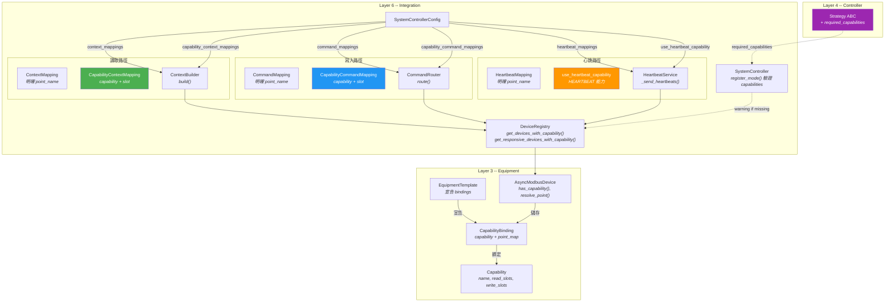
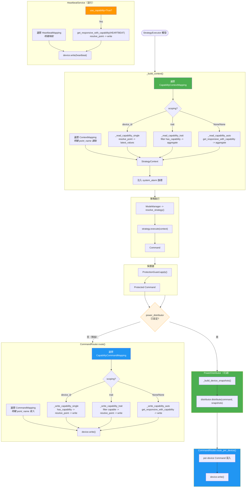
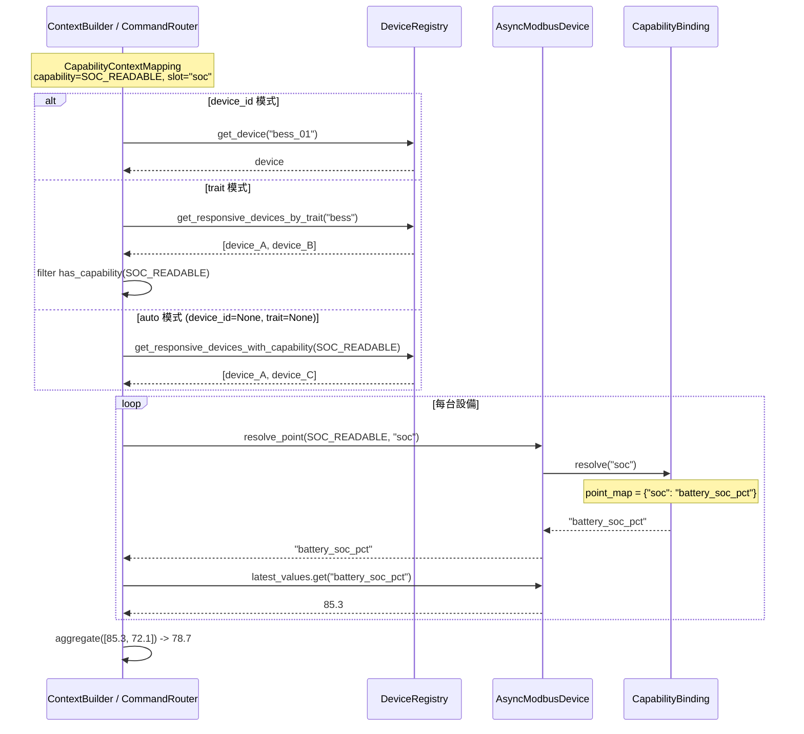
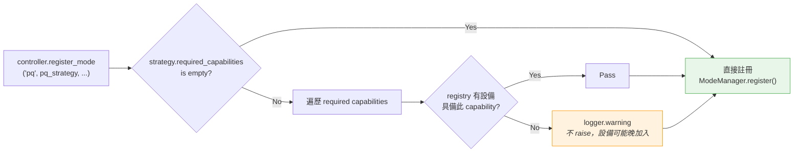

---
tags:
  - type/architecture
  - layer/integration
  - status/complete
created: 2026-03-06
updated: 2026-04-04
version: ">=0.4.2"
---

# CapabilityBinding Integration

能力驅動的設備整合 -- 架構與流程圖，隸屬於 [[_MOC Integration|Integration 模組]]。

## 設計動機

csp_lib 的 Capability 系統定義了 9 個標準能力（HEARTBEAT、ACTIVE_POWER_CONTROL 等），每個能力使用語意插槽 (slot) 描述讀/寫操作。不同設備透過 `CapabilityBinding` 將 slot 映射到各自的實際點位名稱。

本整合讓 Capability 從純粹的 metadata 宣告，升級為設備整合的驅動力：

- **讀取**：[[CapabilityContextMapping]] 用 capability slot 自動解析點位
- **寫入**：[[CapabilityCommandMapping]] 用 capability slot 自動路由寫入
- **心跳**：`use_heartbeat_capability` 自動發現 HEARTBEAT 設備
- **驗證**：`Strategy.required_capabilities` 在註冊時檢查設備能力

## 層級架構圖



## 控制迴圈流程圖

完整的 Pipeline：讀取 → 策略執行 → 保護 → 寫入（含心跳並行）。



## Capability 解析序列圖

展示 `resolve_point` 在讀取路徑中的完整呼叫鏈。



## Strategy 能力驗證流程



## 三種 Scoping 模式對照

| | device_id 模式 | trait 模式 | auto 模式 |
|---|---|---|---|
| `device_id` | `"pcs_01"` | `None` | `None` |
| `trait` | `None` | `"pcs"` | `None` |
| Context 讀取來源 | 單一設備 | trait 內 capable 設備 | 所有 capable 設備 |
| Command 寫入目標 | 單一設備 | trait 內廣播 | 所有 capable 廣播 |
| 聚合 | 不聚合 | aggregate 函式 | aggregate 函式 |
| 點位解析 | `device.resolve_point(capability, slot)` | 同左 | 同左 |

## 向後相容性

| 項目 | 相容性 | 說明 |
|------|--------|------|
| `SystemControllerConfig` | 完全相容 | 新欄位皆有預設值 |
| `ContextBuilder` | 完全相容 | `capability_mappings` 預設 `None` |
| `CommandRouter` | 完全相容 | `capability_mappings` 預設 `None` |
| `Strategy` ABC | 完全相容 | `required_capabilities` 預設 `()` |
| `HeartbeatService` | 不變 | 已支援 `use_capability` |
| 既有 `ContextMapping` / `CommandMapping` | 不變 | 明確映射路徑完全保留 |
| `PowerDistributor` | 完全相容 | `power_distributor` 預設 `None`，不設定時行為不變 |

## 層級邊界驗證

| 變更 | 依賴方向 | 合規 |
|------|----------|------|
| `schema.py` 引用 `Capability` | Layer 6 → Layer 3 | 合規 |
| `context_builder.py` 使用 `has_capability()` | Layer 6 → Layer 3 | 合規 |
| `command_router.py` 使用 `resolve_point()` | Layer 6 → Layer 3 | 合規 |
| `strategy.py` TYPE_CHECKING `Capability` | Layer 4 → Layer 3 (type only) | 合規 |
| `system_controller.py` 驗證 capabilities | Layer 6 → Layer 3, 4 | 合規 |

## 完整使用範例

```python
from csp_lib.equipment.device.capability import (
    ACTIVE_POWER_CONTROL, HEARTBEAT, MEASURABLE, SOC_READABLE,
)
from csp_lib.integration import (
    SystemController, SystemControllerConfig,
    CapabilityContextMapping, CapabilityCommandMapping,
    AggregateFunc,
)

config = SystemControllerConfig(
    # Heartbeat：自動發現，不需要明確 mapping
    use_heartbeat_capability=True,

    # Context：用 capability 讀取 SOC 和功率
    capability_context_mappings=[
        CapabilityContextMapping(
            capability=SOC_READABLE, slot="soc", context_field="soc",
        ),
        CapabilityContextMapping(
            capability=MEASURABLE, slot="active_power",
            context_field="extra.grid_power",
            aggregate=AggregateFunc.SUM,
        ),
    ],

    # Command：用 capability 寫入 P setpoint
    capability_command_mappings=[
        CapabilityCommandMapping(
            command_field="p_target",
            capability=ACTIVE_POWER_CONTROL, slot="p_setpoint",
        ),
    ],
)

controller = SystemController(registry, config)
# 明確 mapping 和 capability mapping 可共存
```

## 相關頁面

- [[CapabilityRequirement]] -- 能力需求定義（preflight validation）
- [[CapabilityContextMapping]] -- Capability-driven context 映射
- [[CapabilityCommandMapping]] -- Capability-driven command 映射
- [[ContextMapping]] -- 明確映射版 context
- [[CommandMapping]] -- 明確映射版 command
- [[ContextBuilder]] -- 讀取路徑實作
- [[CommandRouter]] -- 寫入路徑實作
- [[PowerDistributor]] -- 功率分配器
- [[SystemController]] -- 頂層控制器配置
- [[DeviceRegistry]] -- 設備 capability 查詢
- [[Strategy]] -- `required_capabilities` 宣告
