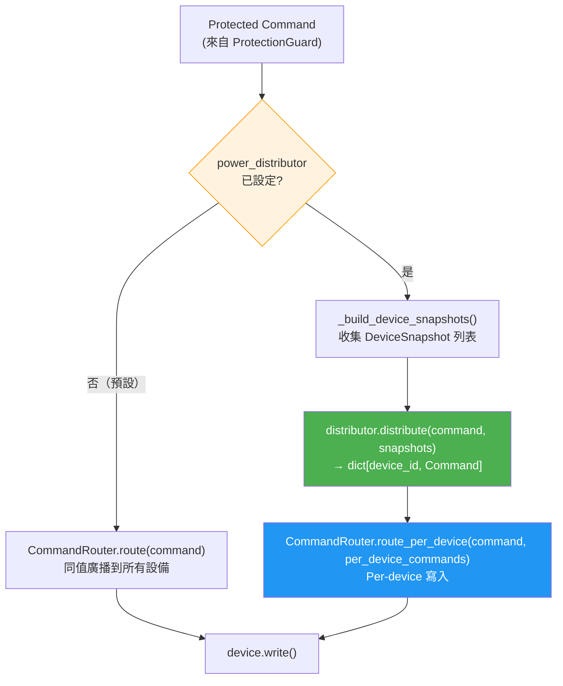

---
tags:
  - type/class
  - type/protocol
  - layer/integration
  - status/complete
source: csp_lib/integration/distributor.py
created: 2026-03-06
updated: 2026-04-04
version: ">=0.4.2"
---

# PowerDistributor

功率分配層，隸屬於 [[_MOC Integration|Integration 模組]]。

## 概述

`PowerDistributor` 是一個功率分配抽象層，位於 `ProtectionGuard` 與 `CommandRouter` 之間。它將系統級 `Command`（已經過保護鏈處理）按策略分配到各個設備，並以 per-device `Command` 的形式交由 `CommandRouter.route_per_device()` 寫入。

若未設定 `power_distributor`，控制迴圈行為完全不變——仍透過 `CommandRouter.route()` 進行同值廣播，確保完全向後相容。

### 架構位置

```
ProtectionGuard → [PowerDistributor] → CommandRouter
```

### 適用場景

- 系統中包含額定容量不同的設備，需要按比例分配功率
- 電池儲能系統（BESS）需要 SOC 平衡，避免過充或過放
- 需要自訂分配邏輯的客製化場景

## DeviceSnapshot

`DeviceSnapshot` 是一個 frozen dataclass，封裝了單台設備在分配決策時所需的所有狀態資訊。

```python
@dataclass(frozen=True)
class DeviceSnapshot:
    device_id: str
    metadata: dict[str, Any]           # 靜態資訊（額定容量等），register() 時提供
    latest_values: dict[str, Any]      # 設備最新讀取值（完整 dict）
    capabilities: dict[str, dict[str, Any]]  # capability_name → {slot: value}
```

### 欄位說明

| 欄位 | 型別 | 說明 |
|------|------|------|
| `device_id` | `str` | 設備唯一識別碼 |
| `metadata` | `dict[str, Any]` | 靜態資訊，來自 [[DeviceRegistry]] 的 `register(metadata=...)` |
| `latest_values` | `dict[str, Any]` | 動態讀取值，來自設備的 `latest_values` dict |
| `capabilities` | `dict[str, dict[str, Any]]` | Capability slot 解析後的值，結構為 `{capability_name: {slot: value}}` |

### `get_capability_value(capability, slot) → Any`

便捷方法，取得指定 capability slot 的值。接受 `Capability` 物件或 capability 名稱字串，不存在時回傳 `None`。

```python
# 取得 SOC 值
soc = snapshot.get_capability_value("soc_readable", "soc")
# 或使用 Capability 物件
soc = snapshot.get_capability_value(SOC_READABLE, "soc")
```

## PowerDistributor Protocol

`PowerDistributor` 為 `@runtime_checkable` Protocol，實作者只需實現一個方法：

```python
@runtime_checkable
class PowerDistributor(Protocol):
    def distribute(
        self,
        command: Command,
        devices: list[DeviceSnapshot],
    ) -> dict[str, Command]:
        ...
```

### `distribute(command, devices) → dict[str, Command]`

| 參數 | 型別 | 說明 |
|------|------|------|
| `command` | `Command` | 系統級命令，已經過 `ProtectionGuard` 處理 |
| `devices` | `list[DeviceSnapshot]` | 可用設備快照（已過濾：responsive + non-protected） |
| 回傳 | `dict[str, Command]` | `device_id` → per-device `Command` 的映射 |

> [!note] 未包含在回傳 dict 中的設備不會被寫入，可藉此實現選擇性寫入。

## 內建分配器

### `EqualDistributor`

將系統功率**均等分配**到所有設備，適合所有設備規格相同的場景。

```python
from csp_lib.integration.distributor import EqualDistributor

distributor = EqualDistributor()
# 3 台設備，系統 P=300 → 每台 P=100
```

**分配邏輯**：`p_each = p_target / n`，`q_each = q_target / n`，無 fallback 邏輯。

---

### `ProportionalDistributor`

依據各設備 `metadata` 中指定的額定功率 key，**按比例分配** P 與 Q。若所有設備的額定值為 0 或缺失，自動 fallback 為均分。

```python
from csp_lib.integration.distributor import ProportionalDistributor

distributor = ProportionalDistributor(rated_key="rated_p")
# 設備 A rated_p=500, 設備 B rated_p=1000
# → A 分得 1/3, B 分得 2/3
```

| 建構參數 | 型別 | 預設 | 說明 |
|----------|------|------|------|
| `rated_key` | `str` | `"rated_p"` | metadata 中額定功率的 key 名稱 |

**Fallback 順序**：比例分配 → 均分（總額定值為 0 時）

---

### `SOCBalancingDistributor`

> [!info] v0.4.2 新增

在按額定容量比例分配的基礎上，根據各設備 SOC 偏差**調整 P 分配權重**，Q 仍按額定容量比例分配。適合電池儲能系統（BESS）。

**分配演算法**：

```
avg_soc = mean(所有設備 SOC)
對每台設備：
    soc_deviation = (device_soc - avg_soc) / 100
    若放電 (P > 0): weight = rated * (1 + gain * soc_deviation)
    若充電 (P < 0): weight = rated * (1 - gain * soc_deviation)
P 按 weight 比例分配，Q 按 rated_p 比例分配
```

```python
from csp_lib.integration.distributor import SOCBalancingDistributor

distributor = SOCBalancingDistributor(
    rated_key="rated_p",
    soc_capability="soc_readable",
    soc_slot="soc",
    gain=2.0,
)
```

| 建構參數 | 型別 | 預設 | 說明 |
|----------|------|------|------|
| `rated_key` | `str` | `"rated_p"` | metadata 中額定功率的 key 名稱 |
| `soc_capability` | `str` | `"soc_readable"` | SOC capability 名稱 |
| `soc_slot` | `str` | `"soc"` | SOC slot 名稱 |
| `gain` | `float` | `2.0` | SOC 偏差增益係數（越大偏差影響越顯著） |
| `per_device_max_p` | `float \| None` | `None` | 單台設備最大有功功率限制 (kW)，`None` 表示不限制 |
| `per_device_max_q` | `float \| None` | `None` | 單台設備最大無功功率限制 (kVar)，`None` 表示不限制 |

#### 硬體限幅與溢出轉移

設定 `per_device_max_p` 或 `per_device_max_q` 後，分配結果會經過限幅處理：

1. **Pass 1**：遍歷每台設備，`|assigned| > max_val` 時限幅（保留符號），累計溢出量
2. **Pass 2**：將溢出量依未飽和設備的當前分配值按比例重新分配
3. **Pass 3**：再次限幅，處理重分配後超限的邊界情況
4. **Pass 4**：剩餘溢出量依 headroom 比例分配

**Fallback 順序**：SOC 平衡分配 → 比例分配（無 SOC 資料時）→ 均分（總額定值為 0 時）

## SystemControllerConfig 設定

`SystemControllerConfig` 新增 `power_distributor` 欄位：

| 欄位 | 型別 | 預設 | 說明 |
|------|------|------|------|
| `power_distributor` | `PowerDistributor \| None` | `None` | 功率分配器實例；`None` 時使用傳統同值廣播 |

## 控制迴圈流程圖



## 使用範例

### 基本用法：比例分配

```python
from csp_lib.integration import SystemController, SystemControllerConfig
from csp_lib.integration.distributor import ProportionalDistributor

# 建立 registry 並註冊設備（含 metadata）
registry.register(bess_a, traits=["bess"], metadata={"rated_p": 500.0})
registry.register(bess_b, traits=["bess"], metadata={"rated_p": 1000.0})

config = SystemControllerConfig(
    capability_context_mappings=[...],
    capability_command_mappings=[...],
    power_distributor=ProportionalDistributor(rated_key="rated_p"),
)

controller = SystemController(registry, config)
```

### 進階用法：SOC 平衡分配

```python
from csp_lib.integration.distributor import SOCBalancingDistributor

config = SystemControllerConfig(
    capability_context_mappings=[...],
    capability_command_mappings=[...],
    power_distributor=SOCBalancingDistributor(
        rated_key="rated_p",
        soc_capability="soc_readable",
        soc_slot="soc",
        gain=2.0,
    ),
)
```

### 自訂分配器

```python
from csp_lib.integration.distributor import PowerDistributor, DeviceSnapshot
from csp_lib.controller.core import Command

class TemperatureWeightedDistributor:
    """依設備溫度調整權重的自訂分配器"""

    def distribute(
        self,
        command: Command,
        devices: list[DeviceSnapshot],
    ) -> dict[str, Command]:
        # 溫度越低，分配越多（避免過熱）
        temps = [d.latest_values.get("temperature", 25.0) for d in devices]
        inv_temps = [1.0 / max(t, 1.0) for t in temps]
        total = sum(inv_temps)
        if total <= 0:
            return {}
        return {
            d.device_id: Command(
                p_target=command.p_target * (inv_temps[i] / total),
                q_target=command.q_target * (inv_temps[i] / total),
            )
            for i, d in enumerate(devices)
        }

config = SystemControllerConfig(
    power_distributor=TemperatureWeightedDistributor(),
    ...
)
```

## 相關頁面

- [[CommandRouter]] — `route_per_device()` 執行 per-device 寫入
- [[DeviceRegistry]] — `register(metadata=...)` 提供靜態 metadata，`get_metadata()` 查詢
- [[SystemController]] — 透過 `SystemControllerConfig.power_distributor` 啟用
- [[CapabilityBinding Integration]] — 完整控制迴圈架構與流程圖
- [[CapabilityCommandMapping]] — Capability-driven command 映射
