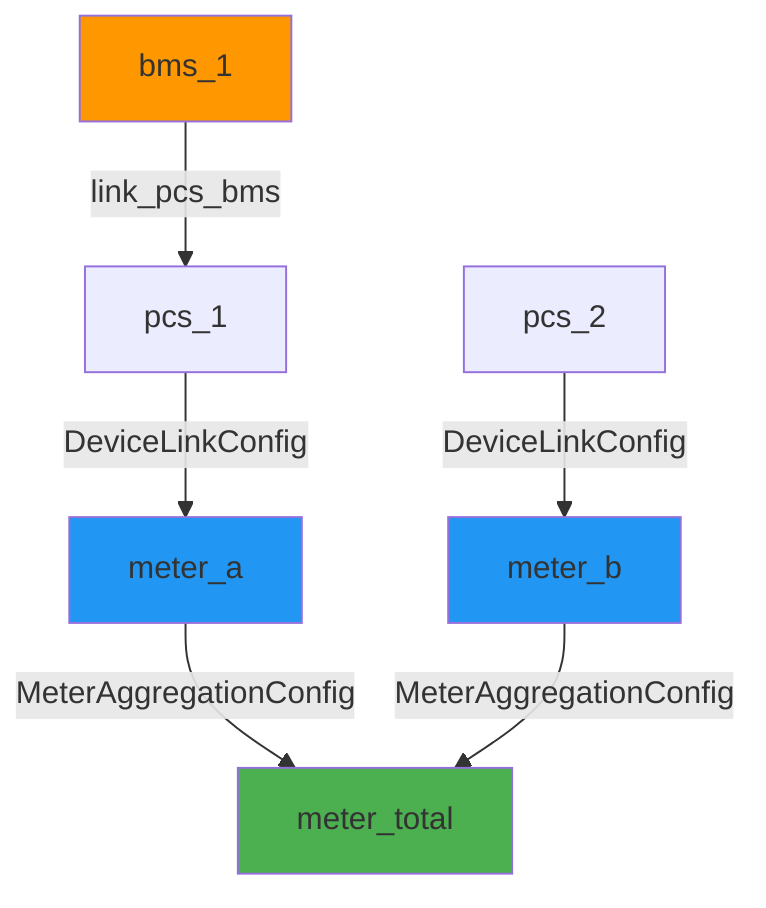

---
tags:
  - type/class
  - layer/modbus-server
  - status/complete
source: csp_lib/modbus_server/config.py
created: 2026-04-05
updated: 2026-04-05
version: ">=0.6.2"
---

# 設備互連（Device Interconnection）

> v0.6.2 新增 — 宣告式多電表功率路由與聚合樹

v0.6.2 為 `MicrogridSimulator` 加入**設備互連**能力，讓模擬場景更接近真實微電網拓撲：
每台 PCS/設備可以明確指定功率流向哪個電表，多個電表也可以透過聚合樹合計到上層電表。

---

## Quick Example — 多 PCS 多電表

```python
from csp_lib.modbus_server import (
    MicrogridSimulator, MicrogridConfig,
    PowerMeterSimulator, PCSSimulator,
    DeviceLinkConfig,
)
from csp_lib.modbus_server.simulator.power_meter import default_meter_config
from csp_lib.modbus_server.simulator.pcs import default_pcs_config
from csp_lib.modbus_server.config import PCSSimConfig

# 建立兩個電表
meter_a = PowerMeterSimulator(default_meter_config("meter_a", unit_id=1))
meter_b = PowerMeterSimulator(default_meter_config("meter_b", unit_id=2))

# 建立兩台 PCS
pcs_1 = PCSSimulator(default_pcs_config("pcs_1", unit_id=3), PCSSimConfig(capacity_kwh=200.0))
pcs_2 = PCSSimulator(default_pcs_config("pcs_2", unit_id=4), PCSSimConfig(capacity_kwh=100.0))

# 組裝微電網
microgrid = MicrogridSimulator(MicrogridConfig())
microgrid.add_meter(meter_a, "meter_a")
microgrid.add_meter(meter_b, "meter_b")
microgrid.add_pcs(pcs_1)
microgrid.add_pcs(pcs_2)

# 指定功率路由：pcs_1 → meter_a（2% 損耗）；pcs_2 → meter_b
microgrid.add_device_link(DeviceLinkConfig("pcs_1", "meter_a", loss_factor=0.02))
microgrid.add_device_link(DeviceLinkConfig("pcs_2", "meter_b"))
```

---

## Quick Example — 電表聚合樹

```python
from csp_lib.modbus_server import MeterAggregationConfig

# meter_total = meter_a + meter_b（聚合電表）
meter_total = PowerMeterSimulator(default_meter_config("meter_total", unit_id=10))
microgrid.add_meter(meter_total, "meter_total")

microgrid.add_meter_aggregation(MeterAggregationConfig(
    source_meter_ids=("meter_a", "meter_b"),
    target_meter_id="meter_total",
))
# 每次 update() 後，meter_total.get_value("active_power") = meter_a.P + meter_b.P
```

---

## DeviceLinkConfig

**設備到電表的連結配置**（frozen dataclass）。

宣告某台設備（PCS/Solar/Load/Generator）的功率流向哪個電表，並可加入損耗因子模擬線路損耗。

```python
from csp_lib.modbus_server import DeviceLinkConfig

link = DeviceLinkConfig(
    source_device_id="pcs_1",   # 必填
    target_meter_id="meter_a",  # 必填
    loss_factor=0.02,           # 2% 損耗（可選，預設 0.0）
)
```

### 欄位說明

| 欄位 | 型別 | 預設 | 說明 |
|------|------|------|------|
| `source_device_id` | `str` | 必填 | 來源設備 ID（需已透過 `add_pcs()` 等方法註冊） |
| `target_meter_id` | `str` | 必填 | 目標電表 ID（需已透過 `add_meter()` 或 `set_meter()` 註冊） |
| `loss_factor` | `float` | `0.0` | 功率損耗因子，範圍 `[0.0, 1.0)` |

### 驗證規則

- `source_device_id` / `target_meter_id` 不可為空字串。
- `loss_factor` 須在 `[0.0, 1.0)` 範圍，`1.0` 不允許（100% 損耗無意義）。

> [!note] 損耗計算
> 每 tick 傳遞到目標電表的有效功率為：
> `effective_P = device_P × (1 - loss_factor)`

---

## MeterAggregationConfig

**電表聚合配置**（frozen dataclass）。

宣告多個子電表的功率累加到一個父電表，支援任意深度的聚合樹。

```python
from csp_lib.modbus_server import MeterAggregationConfig

agg = MeterAggregationConfig(
    source_meter_ids=("meter_a", "meter_b"),
    target_meter_id="meter_total",
)
```

### 欄位說明

| 欄位 | 型別 | 說明 |
|------|------|------|
| `source_meter_ids` | `tuple[str, ...]` | 來源電表 ID 集合（不可為空） |
| `target_meter_id` | `str` | 目標（父）電表 ID |

### 驗證規則

- `source_meter_ids` 不可為空。
- `target_meter_id` 不可出現在 `source_meter_ids` 中（防止自環）。
- 所有 ID 須已透過 `add_meter()` 或 `set_meter()` 註冊，否則 `add_meter_aggregation()` 拋出 `ConfigurationError`。
- 若聚合圖存在循環，Kahn 拓撲排序會在 `add_meter_aggregation()` 時立即偵測並拋出 `ConfigurationError`（**不需等到 `update()`**）。

> [!warning] 循環偵測時機
> 循環偵測在 `add_meter_aggregation()` 呼叫時**立即執行**，失敗時自動回滾（不寫入）。
> 確保配置安全，不會留下半成功狀態。

---

## MicrogridSimulator — 多電表 API

v0.6.2 新增以下方法與屬性（與 v0.6.1 向後相容）：

### 電表管理

| 方法 / 屬性 | 簽名 | 說明 |
|-------------|------|------|
| `add_meter()` | `(meter, meter_id=None) → None` | 註冊電表；第一個自動成為 default |
| `get_meter()` | `(meter_id: str) → PowerMeterSimulator` | 取得指定電表，不存在拋 `KeyError` |
| `meters` | `dict[str, PowerMeterSimulator]`（property） | 所有已註冊電表的唯讀副本 |
| `set_meter()` | `(meter) → None` | 向後相容：等同 `add_meter()` 並設為 default |
| `meter` | `PowerMeterSimulator \| None`（property） | 向後相容：回傳 default 電表 |

### 設備連結

| 方法 | 簽名 | 說明 |
|------|------|------|
| `add_device_link()` | `(link: DeviceLinkConfig) → None` | 新增設備到電表的功率路由 |

**錯誤條件：**
- 設備 `source_device_id` 未透過 `add_pcs()`/`add_solar()`/`add_load()`/`add_generator()` 註冊 → `ConfigurationError`
- 電表 `target_meter_id` 未透過 `add_meter()` 或 `set_meter()` 註冊 → `ConfigurationError`
- 同一設備已有連結（不允許一設備連結多電表） → `ConfigurationError`

### 電表聚合

| 方法 | 簽名 | 說明 |
|------|------|------|
| `add_meter_aggregation()` | `(agg: MeterAggregationConfig) → None` | 新增電表聚合，立即驗證循環 |

---

## PCS-BMS 連結

除設備到電表的功率路由外，v0.6.2 也新增 **PCS-BMS 連結**，讓 BMS 模擬器接管 PCS 的 SOC 管理，模擬更真實的電池行為。

### add_bms() 與 link_pcs_bms()

```python
from csp_lib.modbus_server.simulator.bms import BMSSimulator, default_bms_config
from csp_lib.modbus_server.config import BMSSimConfig

bms = BMSSimulator(
    default_bms_config("bms_1", unit_id=20),
    BMSSimConfig(capacity_kwh=200.0, initial_soc=60.0),
)

microgrid.add_pcs(pcs)
microgrid.add_bms(bms)                    # 先註冊 BMS
microgrid.link_pcs_bms("pcs_1", "bms_1") # 再建立連結
```

| 方法 | 簽名 | 說明 |
|------|------|------|
| `add_bms()` | `(bms: BMSSimulator) → None` | 註冊 BMS；`device_id` 重複拋 `ConfigurationError` |
| `link_pcs_bms()` | `(pcs_id: str, bms_id: str) → None` | 連結 PCS 與 BMS；兩者需已分別透過 `add_pcs()` / `add_bms()` 註冊；一台 PCS 只能連結一個 BMS |

連結後的 tick 行為（Step 5）：

```
PCS.update() → 計算 p_actual（setpoint ramp）
BMS.update_power(p_actual, dt) → 計算 SOC/電壓/溫度/告警
PCS.set_value("soc", bms.soc) → PCS SOC 同步為 BMS 值
```

> [!note] 未連結 PCS
> 沒有連結 BMS 的 PCS 繼續使用內建 `update_soc()` 方法，行為與 v0.6.1 相同。

---

## 功率符號說明（Sign Convention）

`MicrogridSimulator` 的功率計算涉及兩層符號系統：

### 設備側符號

| 設備類型 | 正值意義 | 負值意義 |
|----------|----------|----------|
| PCS | 放電（discharge） | 充電（charge） |
| BMS | 放電（與 PCS 一致） | 充電（與 PCS 一致） |
| Solar / Generator | 發電量（恆正） | — |
| Load | 用電量（恆正） | — |

### 電表側符號（power_sign）

電表的 `active_power` 讀數受 `PowerMeterSimConfig.power_sign` 控制：

- `power_sign = +1.0`（**表後**，預設）：PCS 放電時電表讀值為正，表示「淨取電」視角
- `power_sign = -1.0`（**表前**）：PCS 放電時電表讀值為負，表示「輸出到電網」視角

### 聚合符號修正（v0.6.2 bug fix）

v0.6.2 之前，電表聚合（Step 8）錯誤使用 `active_power`（已套用 `power_sign`），導致混合符號電表相加時結果錯誤。

v0.6.2 修正為使用 `_raw_net_p`（原始物理淨功率，尚未套用 `power_sign`），聚合後再由目標電表的 `set_partial_reading()` 套用自身 `power_sign`：

```
# 修正前（v0.6.1，有 bug）
sum_p = sum(meter.get_value("active_power") for meter in sources)

# 修正後（v0.6.2）
sum_p = sum(meter._raw_net_p for meter in sources)
```

> [!warning] 影響範圍
> 只有**同時使用不同 `power_sign` 的混合電表聚合**場景才會受影響。
> 所有電表均使用相同 `power_sign` 時，修正前後結果一致。

---

## Tick 更新流程（v0.6.2 完整版）

`update(tick_interval)` 每次 tick 依以下順序執行：

```
Step 1  計算系統電壓/頻率（標稱值 + 隨機擾動）
Step 2  更新 Solar — 產出功率，注入 V/F
Step 3  更新 Generator — 產出功率
Step 4  更新 Load — 消耗功率，注入 V/F
Step 5  更新 PCS — setpoint ramp；若有 BMS 連結，由 BMS 計算 SOC 並同步回 PCS（v0.6.2）
Step 6  重置所有電表的 linked power 累加器
Step 7a 處理設備連結：device.P × (1 - loss_factor) → target_meter
Step 7b 未連結設備的淨功率 → default 電表
Step 7c Finalize 所有電表（寫入 V/F + 計算衍生值）
Step 8  電表聚合樹（Kahn 拓撲排序後依序執行）
Step 9  所有電表累積電量（∫P dt / 3600）
```

### 拓撲排序示意



---

## PowerMeterSimulator — 連結相關方法

這些方法由 `MicrogridSimulator.update()` 在每個 tick 內部呼叫，通常不需要直接使用：

| 方法 | 簽名 | 說明 |
|------|------|------|
| `reset_linked_power()` | `() → None` | 重置 tick 開始時的功率累加器 |
| `add_linked_power()` | `(p: float, q: float) → None` | 累加來自連結設備的功率（可多次呼叫） |
| `finalize_linked_reading()` | `(v: float, f: float) → None` | 累加完畢後寫入 V/F，計算視在功率、功率因數、電流 |
| `set_partial_reading()` | `(p: float, q: float) → None` | 只更新 P/Q，**不覆蓋** V/F；用於聚合電表 |

> [!note] 為何 set_partial_reading 不更新 V/F？
> 聚合電表（如 `meter_total`）的電壓/頻率已由 Step 7c 的 `finalize_linked_reading()` 設定。
> Step 8 的聚合只需更新功率值，不應破壞已設定的 V/F 讀數。

---

## Common Patterns

### 場景一：兩棟建築共享電網連接點

```python
# 建築 A：PCS + Solar → meter_a
# 建築 B：PCS + Load → meter_b
# 電網連接點：meter_grid = meter_a + meter_b

microgrid.add_meter(meter_a, "meter_a")
microgrid.add_meter(meter_b, "meter_b")
microgrid.add_meter(meter_grid, "meter_grid")

microgrid.add_device_link(DeviceLinkConfig("pcs_a", "meter_a"))
microgrid.add_device_link(DeviceLinkConfig("solar_a", "meter_a"))
microgrid.add_device_link(DeviceLinkConfig("pcs_b", "meter_b"))
microgrid.add_device_link(DeviceLinkConfig("load_b", "meter_b"))

microgrid.add_meter_aggregation(MeterAggregationConfig(
    source_meter_ids=("meter_a", "meter_b"),
    target_meter_id="meter_grid",
))
```

### 場景二：向後相容（單電表，無連結）

```python
# v0.6.1 以前的寫法完全相容
microgrid = MicrogridSimulator()
microgrid.set_meter(meter_sim)      # 等同 add_meter + 設為 default
microgrid.add_pcs(pcs_sim)
microgrid.add_solar(solar_sim)
# 所有未連結設備的淨功率自動流向 default 電表
```

---

## Gotchas / Tips

- **設備必須先 `add_*()` 再 `add_device_link()`** — 系統在 `add_device_link()` 時驗證設備存在，順序錯誤會拋 `ConfigurationError`。
- **電表也必須先 `add_meter()` 再 `add_device_link()` 或 `add_meter_aggregation()`** — 同理。
- **同一設備只能連結一個電表** — 若需要同時計入多個電表，建議用中間電表 + 聚合樹。
- **未連結的設備自動流向 default 電表** — 第一個 `add_meter()` 的電表即為 default；也可用 `set_meter()` 明確設定。
- **聚合電表也會累積電量** — Step 9 對所有電表（包含聚合電表）執行 `accumulate_energy()`，注意避免雙重計算。

---

## 相關頁面

- [[MicrogridSimulator]] — 微電網協調器完整文件
- [[Simulators]] — PCSSimulator、PowerMeterSimulator 等設備模擬器
- [[SimulationServer]] — 整合 MicrogridSimulator 的 Modbus TCP 伺服器
- [[_MOC Modbus Server]] — 模組總覽
