---
tags:
  - type/reference
  - status/complete
created: 2026-02-17
updated: 2026-04-04
version: 0.6.1
---

# UML Class Diagrams — csp_lib

## 1. Architecture Overview

High-level view of the layered architecture with key classes and their relationships.

```mermaid
classDiagram
    direction TB

    namespace Core {
        class AsyncLifecycleMixin {
            +start()
            +stop()
            +__aenter__()
            +__aexit__()
        }
        class HealthCheckable {
            <<protocol>>
            +health() HealthReport
        }
        class DeviceError
        class ConfigurationError
        class CircuitState {
            <<enumeration>>
            CLOSED
            OPEN
            HALF_OPEN
        }
        class CircuitBreaker {
            +state CircuitState
            +record_success()
            +record_failure()
            +reset()
            +allows_request() bool
        }
        class RetryPolicy {
            <<frozen dataclass>>
            +max_retries int
            +base_delay float
            +exponential_base float
        }
        class RuntimeParameters {
            +get(key) Any
            +set(key, value)
            +snapshot() dict
        }
    }

    namespace Modbus {
        class ModbusDataType {
            <<abstract>>
            +register_count int
            +encode() list~int~
            +decode() Any
        }
        class AsyncModbusClientBase {
            <<abstract>>
            +connect()
            +disconnect()
            +read_holding_registers()
            +write_multiple_registers()
        }
        class ModbusCodec {
            +encode()
            +decode()
        }
    }

    namespace CAN {
        class CANBusConfig {
            <<frozen dataclass>>
            +interface str
            +channel str
            +bitrate int
        }
        class AsyncCANClientBase {
            <<abstract>>
            +connect()
            +disconnect()
            +send()
            +subscribe()
            +request()
        }
        class PythonCANClient
    }

    namespace Equipment {
        class AsyncModbusDevice {
            +device_id str
            +is_connected bool
            +latest_values dict
            +start()
            +stop()
            +read_once()
            +write_point()
            +on()
        }
        class AsyncCANDevice
        class DeviceProtocol {
            <<protocol>>
        }
        class DeviceConfig
        class ReadPoint
        class WritePoint
        class ProcessingPipeline
        class AlarmStateManager
        class DeviceEventEmitter
        class GroupReader
        class ReadScheduler
        class ValidatedWriter
    }

    namespace Controller {
        class Strategy {
            <<abstract>>
            +execute(ctx) Command
            +on_activate()
            +on_deactivate()
        }
        class StrategyExecutor {
            +set_strategy()
            +run()
            +stop()
            +trigger()
        }
        class ModeManager {
            +register()
            +set_base_mode()
            +push_override()
            +pop_override()
            +get_active_strategy()
        }
        class ProtectionGuard {
            +apply(cmd, ctx) Command
        }
        class Command {
            +p_target float
            +q_target float
        }
        class StrategyContext {
            +soc float
            +last_command Command
            +system_base SystemBase
        }
        class EventDrivenOverride {
            <<protocol>>
            +name str
            +cooldown_seconds float
            +should_activate(ctx) bool
        }
        class CommandProcessor {
            <<protocol>>
            +process(cmd, ctx) Command
        }
        class DroopStrategy
        class RampStopStrategy
        class PowerCompensator {
            +process(cmd, ctx) Command
        }
        class FFCalibrationStrategy
        class DynamicSOCProtection
        class GridLimitProtection
        class RampStopProtection
        class LoadSheddingStrategy
        class SwitchSource {
            <<enumeration>>
            MANUAL
            SCHEDULE
            EVENT
            INTERNAL
        }
    }

    namespace Manager {
        class UnifiedDeviceManager {
            +register_device()
            +register_group()
        }
        class DeviceManager {
            +register()
            +register_group()
        }
        class AlarmPersistenceManager
        class WriteCommandManager
        class DataUploadManager
        class StateSyncManager
    }

    namespace Integration {
        class SystemController {
            +register_mode()
            +set_base_mode()
            +push_override()
            +pop_override()
            +health()
            +route_per_device()
            +register_event_override()
        }
        class DeviceRegistry {
            +register()
            +get_device()
            +get_devices_by_trait()
        }
        class ContextBuilder {
            +build() StrategyContext
        }
        class CommandRouter {
            +route(cmd)
            +route_per_device(cmd, per_device)
        }
        class PowerDistributor {
            <<protocol>>
            +distribute(cmd, devices) dict
        }
        class HeartbeatService
    }

    namespace Storage {
        class MongoClient
        class MongoBatchUploader
        class RedisClient
    }

    namespace ModbusGateway {
        class ModbusGatewayServer {
            +start()
            +stop()
            +update_register(address, value)
        }
        class GatewayRegisterMap
        class CommunicationWatchdog
    }

    namespace Statistics {
        class StatisticsEngine
        class DeviceEnergyTracker
        class StatisticsManager
    }

    %% Core inheritance
    AsyncModbusDevice ..|> HealthCheckable
    DeviceManager --|> AsyncLifecycleMixin
    UnifiedDeviceManager --|> AsyncLifecycleMixin
    SystemController --|> AsyncLifecycleMixin

    %% CircuitBreaker
    CircuitBreaker --> CircuitState

    %% CAN
    PythonCANClient --|> AsyncCANClientBase

    %% Equipment
    AsyncModbusDevice ..|> DeviceProtocol
    AsyncCANDevice ..|> DeviceProtocol
    AsyncCANDevice *-- AsyncCANClientBase

    %% Equipment composition
    AsyncModbusDevice *-- DeviceConfig
    AsyncModbusDevice *-- AsyncModbusClientBase
    AsyncModbusDevice *-- GroupReader
    AsyncModbusDevice *-- ReadScheduler
    AsyncModbusDevice *-- ValidatedWriter
    AsyncModbusDevice *-- AlarmStateManager
    AsyncModbusDevice *-- DeviceEventEmitter
    AsyncModbusDevice o-- ReadPoint
    AsyncModbusDevice o-- WritePoint

    ReadPoint *-- ProcessingPipeline
    GroupReader --> AsyncModbusClientBase
    GroupReader --> ModbusCodec

    %% Controller
    LoadSheddingStrategy --|> Strategy
    DroopStrategy --|> Strategy
    RampStopStrategy --|> Strategy
    FFCalibrationStrategy --|> Strategy
    PowerCompensator ..|> CommandProcessor
    DynamicSOCProtection --|> ProtectionRule
    GridLimitProtection --|> ProtectionRule
    RampStopProtection --|> ProtectionRule
    ModeManager --> SwitchSource

    %% Controller composition
    StrategyExecutor o-- Strategy
    StrategyExecutor --> StrategyContext
    StrategyExecutor --> Command
    ModeManager o-- ModeDefinition
    ProtectionGuard o-- ProtectionRule

    %% Manager composition
    UnifiedDeviceManager *-- DeviceManager
    UnifiedDeviceManager o-- AlarmPersistenceManager
    UnifiedDeviceManager o-- WriteCommandManager
    UnifiedDeviceManager o-- DataUploadManager
    UnifiedDeviceManager o-- StateSyncManager
    DeviceManager o-- AsyncModbusDevice

    %% Integration composition
    SystemController *-- ModeManager
    SystemController *-- ProtectionGuard
    SystemController *-- ContextBuilder
    SystemController *-- CommandRouter
    SystemController *-- StrategyExecutor
    SystemController *-- DeviceRegistry
    SystemController o-- PowerDistributor
    SystemController o-- EventDrivenOverride
    SystemController o-- HeartbeatService
    ContextBuilder --> DeviceRegistry
    CommandRouter --> DeviceRegistry
    ContextBuilder ..> StrategyContext : creates
    CommandRouter ..> Command : consumes

    %% Storage usage
    AlarmPersistenceManager --> MongoClient
    DataUploadManager --> MongoBatchUploader
    StateSyncManager --> RedisClient

    %% Modbus Gateway
    ModbusGatewayServer --|> AsyncLifecycleMixin
    ModbusGatewayServer *-- GatewayRegisterMap
    ModbusGatewayServer o-- CommunicationWatchdog

    %% Statistics
    StatisticsManager --|> DeviceEventSubscriber
    StatisticsManager *-- StatisticsEngine
    StatisticsEngine o-- DeviceEnergyTracker
```

---

## 2. Core Layer

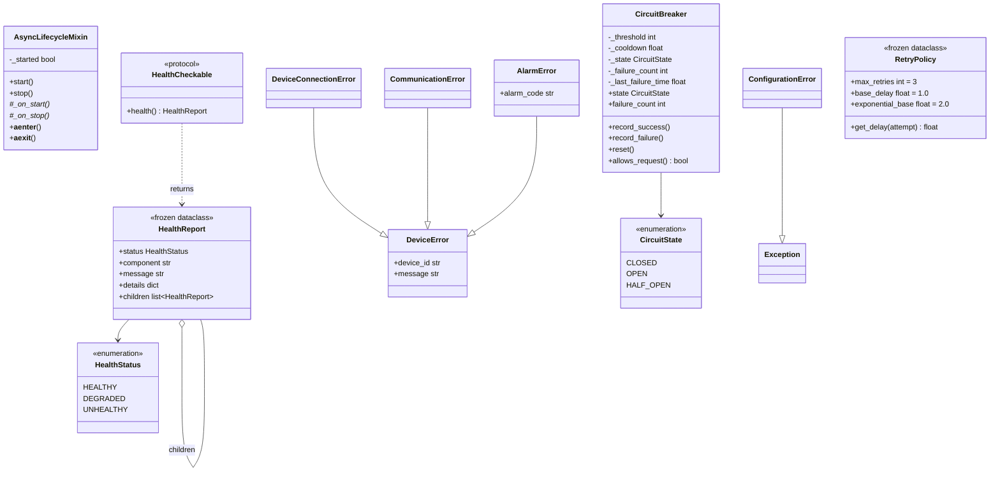

---

## 3. Modbus Layer

```mermaid
classDiagram
    direction TB

    class ByteOrder {
        <<enumeration>>
        BIG_ENDIAN
        LITTLE_ENDIAN
    }

    class RegisterOrder {
        <<enumeration>>
        HIGH_FIRST
        LOW_FIRST
    }

    class Parity {
        <<enumeration>>
        NONE
        EVEN
        ODD
    }

    class FunctionCode {
        <<IntEnum>>
        READ_COILS = 0x01
        READ_DISCRETE_INPUTS = 0x02
        READ_HOLDING_REGISTERS = 0x03
        READ_INPUT_REGISTERS = 0x04
        WRITE_SINGLE_COIL = 0x05
        WRITE_SINGLE_REGISTER = 0x06
        WRITE_MULTIPLE_COILS = 0x0F
        WRITE_MULTIPLE_REGISTERS = 0x10
    }

    class ModbusDataType {
        <<abstract>>
        +register_count* int
        +encode(value, byte_order, register_order)* list~int~
        +decode(registers, byte_order, register_order)* Any
    }
    class Int16
    class UInt16
    class Int32
    class UInt32
    class Int64
    class UInt64
    class Float32
    class Float64
    class ModbusString {
        +max_length int
    }
    class DynamicInt {
        +num_registers int
    }
    class DynamicUInt {
        +num_registers int
    }

    Int16 --|> ModbusDataType
    UInt16 --|> ModbusDataType
    Int32 --|> ModbusDataType
    UInt32 --|> ModbusDataType
    Int64 --|> ModbusDataType
    UInt64 --|> ModbusDataType
    Float32 --|> ModbusDataType
    Float64 --|> ModbusDataType
    ModbusString --|> ModbusDataType
    DynamicInt --|> ModbusDataType
    DynamicUInt --|> ModbusDataType

    class ModbusCodec {
        +encode(data_type, value, byte_order, register_order) list~int~
        +decode(data_type, registers, byte_order, register_order) Any
    }

    ModbusCodec --> ModbusDataType

    class AsyncModbusClientBase {
        <<abstract>>
        +connect()*
        +disconnect()*
        +is_connected()* bool
        +read_coils(address, count, unit)*
        +read_discrete_inputs(address, count, unit)*
        +read_holding_registers(address, count, unit)*
        +read_input_registers(address, count, unit)*
        +write_single_coil(address, value, unit)*
        +write_single_register(address, value, unit)*
        +write_multiple_coils(address, values, unit)*
        +write_multiple_registers(address, values, unit)*
    }

    class PymodbusTcpClient {
        -_config ModbusTcpConfig
        -_client AsyncModbusTcpClient
    }
    class PymodbusRtuClient {
        -_config ModbusRtuConfig
        -_client AsyncModbusSerialClient
    }
    class SharedPymodbusTcpClient {
        -_config ModbusTcpConfig
        -_lock asyncio.Lock
    }

    PymodbusTcpClient --|> AsyncModbusClientBase
    PymodbusRtuClient --|> AsyncModbusClientBase
    SharedPymodbusTcpClient --|> AsyncModbusClientBase

    class ModbusTcpConfig {
        <<frozen dataclass>>
        +host str
        +port int = 502
        +timeout float = 0.5
        +byte_order ByteOrder
        +register_order RegisterOrder
    }

    class ModbusRtuConfig {
        <<frozen dataclass>>
        +port str
        +baudrate int = 9600
        +parity Parity
        +stopbits int = 1
        +bytesize int = 8
        +timeout float = 0.5
        +byte_order ByteOrder
        +register_order RegisterOrder
    }

    PymodbusTcpClient --> ModbusTcpConfig
    PymodbusRtuClient --> ModbusRtuConfig
    SharedPymodbusTcpClient --> ModbusTcpConfig
    ModbusTcpConfig --> ByteOrder
    ModbusTcpConfig --> RegisterOrder
    ModbusRtuConfig --> ByteOrder
    ModbusRtuConfig --> RegisterOrder
    ModbusRtuConfig --> Parity

    class ModbusError
    class ModbusEncodeError
    class ModbusDecodeError
    class ModbusConfigError
    class ModbusCircuitBreakerError
    class ModbusQueueFullError

    ModbusEncodeError --|> ModbusError
    ModbusDecodeError --|> ModbusError
    ModbusConfigError --|> ModbusError
    ModbusCircuitBreakerError --|> ModbusError
    ModbusQueueFullError --|> ModbusError
```

---

## 3b. CAN Layer

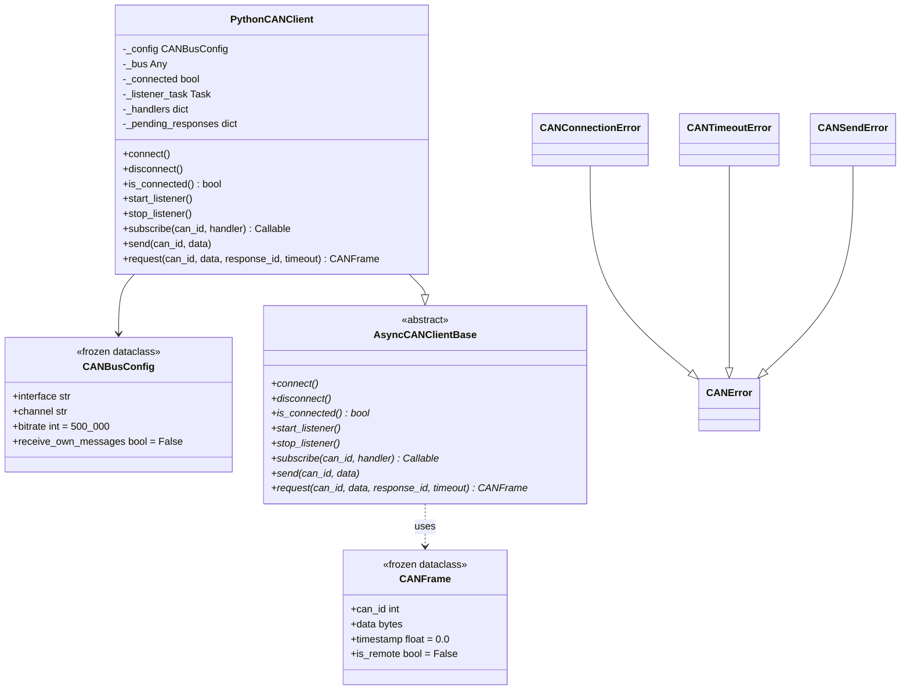

---

## 4. Equipment Layer

### 4a. Points & Transforms

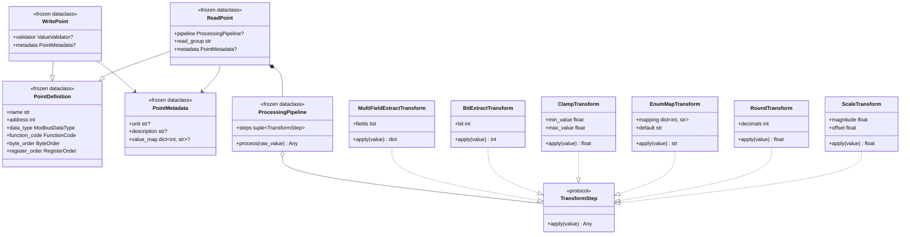

### 4b. Alarm System

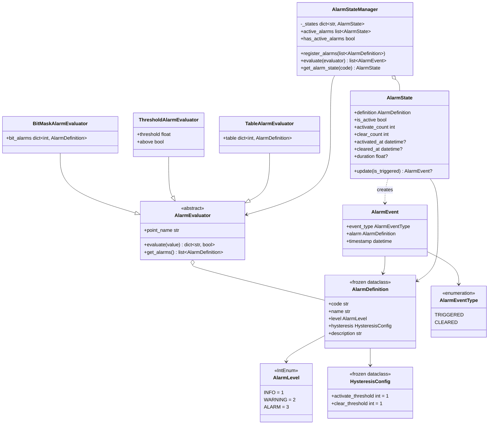

### 4c. Transport & Device

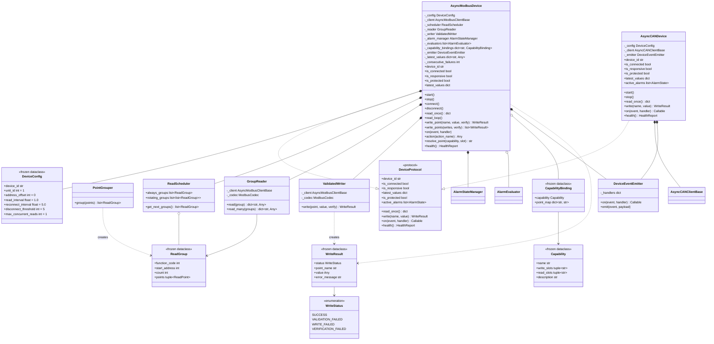

### 4d. Device Events

---

## 5. Controller Layer

### 5a. Command & Strategy

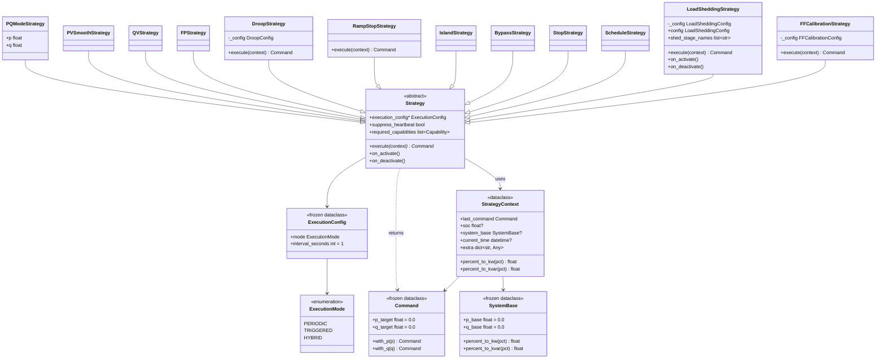

### 5b. Executor & Mode Management

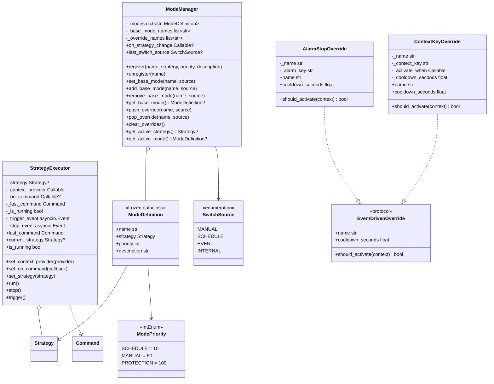

### 5c. Protection & Cascading

```mermaid
classDiagram
    direction TB

    class ProtectionRule {
        <<abstract>>
        +name* str
        +evaluate(command, context)* Command
        +is_triggered* bool
    }

    class SOCProtection {
        +soc_high float
        +soc_low float
        +warning_band float
        +name str
        +evaluate(command, context) Command
        +is_triggered bool
    }

    class ReversePowerProtection {
        +name str
        +evaluate(command, context) Command
        +is_triggered bool
    }

    class SystemAlarmProtection {
        +name str
        +evaluate(command, context) Command
        +is_triggered bool
    }

    class DynamicSOCProtection {
        +name str
        +evaluate(command, context) Command
        +is_triggered bool
    }

    class GridLimitProtection {
        +name str
        +evaluate(command, context) Command
        +is_triggered bool
    }

    class RampStopProtection {
        +name str
        +evaluate(command, context) Command
        +is_triggered bool
    }

    SOCProtection --|> ProtectionRule
    ReversePowerProtection --|> ProtectionRule
    SystemAlarmProtection --|> ProtectionRule
    DynamicSOCProtection --|> ProtectionRule
    GridLimitProtection --|> ProtectionRule
    RampStopProtection --|> ProtectionRule

    class ProtectionGuard {
        -_rules list~ProtectionRule~
        +apply(command, context) Command
        +health() HealthReport
    }

    ProtectionGuard o-- ProtectionRule

    class CapacityConfig {
        <<frozen dataclass>>
        +s_max_kva float
    }

    class CascadingStrategy {
        +layers list~Strategy~
        +capacity CapacityConfig
        +execute(context) Command
    }

    CascadingStrategy --|> Strategy
    CascadingStrategy o-- Strategy : layers
    CascadingStrategy --> CapacityConfig
```

### 5d. CommandProcessor Pipeline（v0.5.1）

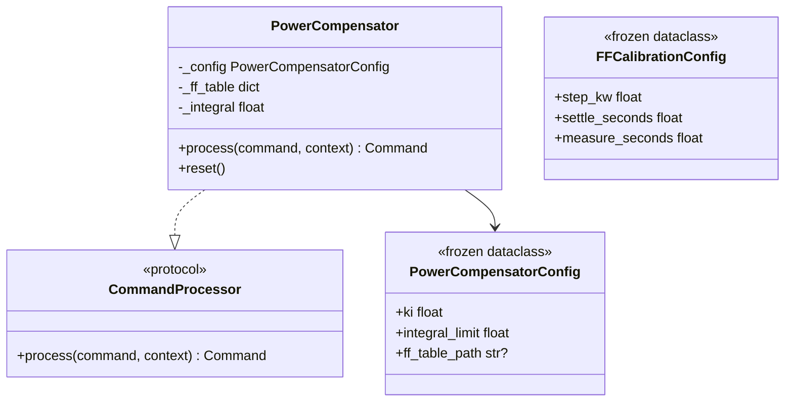

---

## 6. Manager Layer

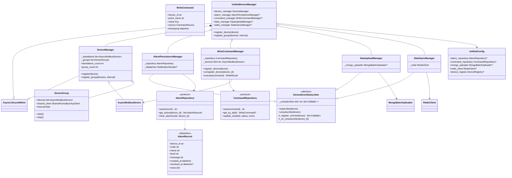

---

## 7. Integration Layer

```mermaid
classDiagram
    direction TB

    class DeviceRegistry {
        -_devices dict~str, AsyncModbusDevice~
        -_device_traits dict~str, set~str~~
        -_trait_devices dict~str, set~str~~
        +register(device, traits)
        +unregister(device_id)
        +add_trait(device_id, trait)
        +remove_trait(device_id, trait)
        +get_device(device_id) AsyncModbusDevice?
        +get_devices_by_trait(trait) list~AsyncModbusDevice~
        +get_responsive_devices_by_trait(trait) list~AsyncModbusDevice~
    }

    DeviceRegistry o-- AsyncModbusDevice

    class AggregateFunc {
        <<enumeration>>
        AVERAGE
        SUM
        MIN
        MAX
        FIRST
    }

    class ContextMapping {
        <<frozen dataclass>>
        +point_name str
        +context_field str
        +device_id str?
        +trait str?
        +aggregate AggregateFunc
        +custom_aggregate Callable?
        +default Any
        +transform Callable?
    }

    ContextMapping --> AggregateFunc

    class CommandMapping {
        <<frozen dataclass>>
        +command_field str
        +point_name str
        +device_id str?
        +trait str?
        +transform Callable?
    }

    class HeartbeatMode {
        <<enumeration>>
        TOGGLE
        INCREMENT
        CONSTANT
    }

    class HeartbeatMapping {
        <<frozen dataclass>>
        +device_id str?
        +trait str?
        +point_name str
        +mode HeartbeatMode
        +value int = 0
        +max_value int = 1
    }

    HeartbeatMapping --> HeartbeatMode

    class ContextBuilder {
        -_registry DeviceRegistry
        -_mappings list~ContextMapping~
        -_system_base SystemBase?
        +build() StrategyContext
    }

    ContextBuilder --> DeviceRegistry
    ContextBuilder o-- ContextMapping
    ContextBuilder ..> StrategyContext : creates

    class CommandRouter {
        -_registry DeviceRegistry
        -_mappings list~CommandMapping~
        +route(command)
        +route_per_device(command, per_device_commands)
    }

    CommandRouter --> DeviceRegistry
    CommandRouter o-- CommandMapping
    CommandRouter --> Command

    class HeartbeatService {
        -_registry DeviceRegistry
        -_mappings list~HeartbeatMapping~
        +start()
        +stop()
        +pause()
        +resume()
    }

    HeartbeatService --> DeviceRegistry
    HeartbeatService o-- HeartbeatMapping

    class DeviceSnapshot {
        <<frozen dataclass>>
        +device_id str
        +metadata dict
        +latest_values dict
        +capabilities dict
        +get_capability_value(capability, slot) Any
    }

    class PowerDistributor {
        <<protocol>>
        +distribute(cmd, devices) dict~str, Command~
    }

    class EqualDistributor {
        +distribute(cmd, devices) dict~str, Command~
    }

    class ProportionalDistributor {
        -_rated_key str
        +distribute(cmd, devices) dict~str, Command~
    }

    class SOCBalancingDistributor {
        -_rated_key str
        -_soc_capability str
        -_soc_slot str
        -_gain float
        +distribute(cmd, devices) dict~str, Command~
    }

    EqualDistributor ..|> PowerDistributor
    ProportionalDistributor ..|> PowerDistributor
    SOCBalancingDistributor ..|> PowerDistributor
    PowerDistributor ..> DeviceSnapshot : uses
    PowerDistributor ..> Command : produces

    class SystemControllerConfig {
        <<dataclass>>
        +context_mappings list~ContextMapping~
        +command_mappings list~CommandMapping~
        +system_base SystemBase?
        +protection_rules list~ProtectionRule~
        +auto_stop_on_alarm bool = True
        +capacity_kva float?
        +heartbeat_mappings list~HeartbeatMapping~
        +power_distributor PowerDistributor?
    }

    class SystemController {
        -_registry DeviceRegistry
        -_mode_manager ModeManager
        -_guard ProtectionGuard
        -_context_builder ContextBuilder
        -_command_router CommandRouter
        -_executor StrategyExecutor
        -_heartbeat HeartbeatService?
        -_power_distributor PowerDistributor?
        -_event_overrides list~EventDrivenOverride~
        +register_mode(name, strategy, priority)
        +set_base_mode(name)
        +push_override(name)
        +pop_override(name)
        +route_per_device(cmd, per_device)
        +register_event_override(override)
        +health() HealthReport
    }

    SystemController --|> AsyncLifecycleMixin
    SystemController *-- DeviceRegistry
    SystemController *-- ModeManager
    SystemController *-- ProtectionGuard
    SystemController *-- ContextBuilder
    SystemController *-- CommandRouter
    SystemController *-- StrategyExecutor
    SystemController o-- HeartbeatService
    SystemController o-- PowerDistributor
    SystemController o-- EventDrivenOverride
    SystemController --> SystemControllerConfig
```

---

## 8. Storage Layer

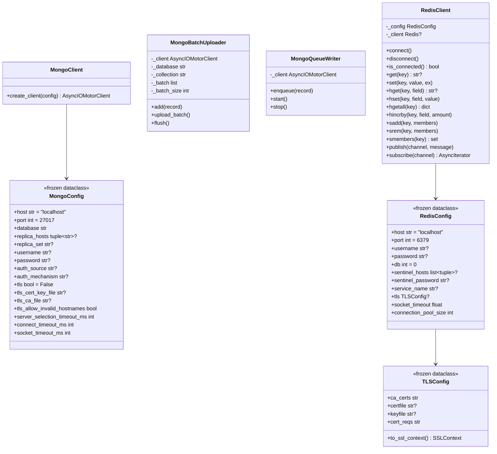

---

## 9. Data Flow — PQ Control Sequence

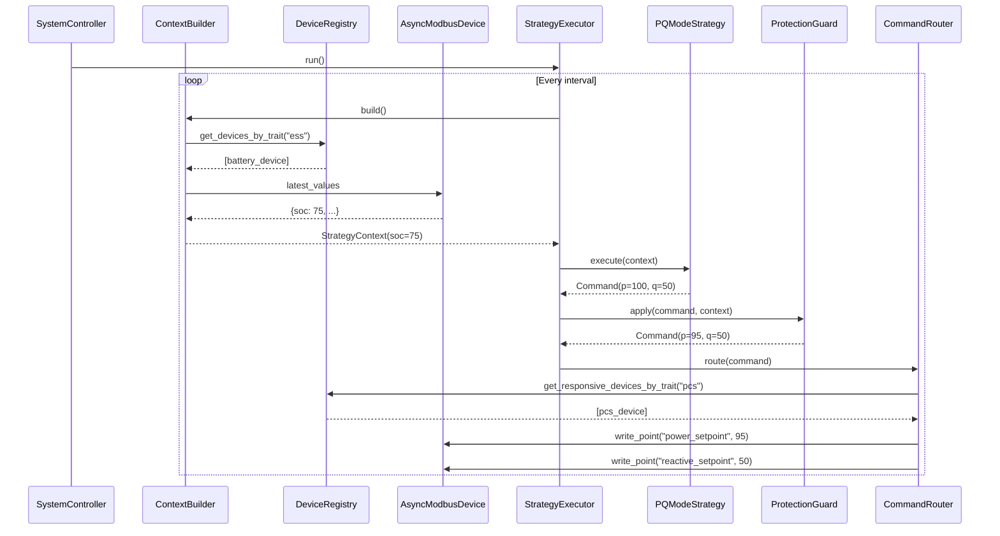

---

## 10. Data Flow — PQ Control with PowerDistributor

帶有 `PowerDistributor` 的多設備功率分配控制流程，展示 `EventDrivenOverride` 評估和 per-device 路由。

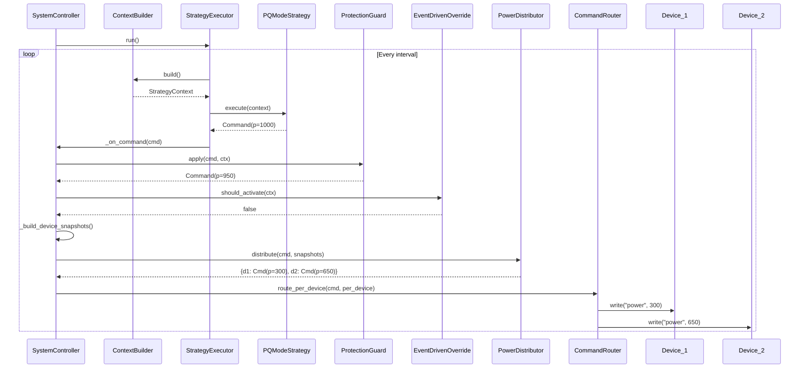

---

## 11. Modbus Gateway Layer（v0.6.0）

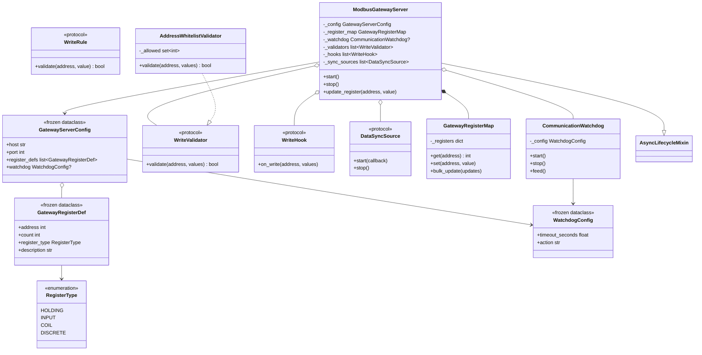

---

## 12. Statistics Layer（v0.6.0）

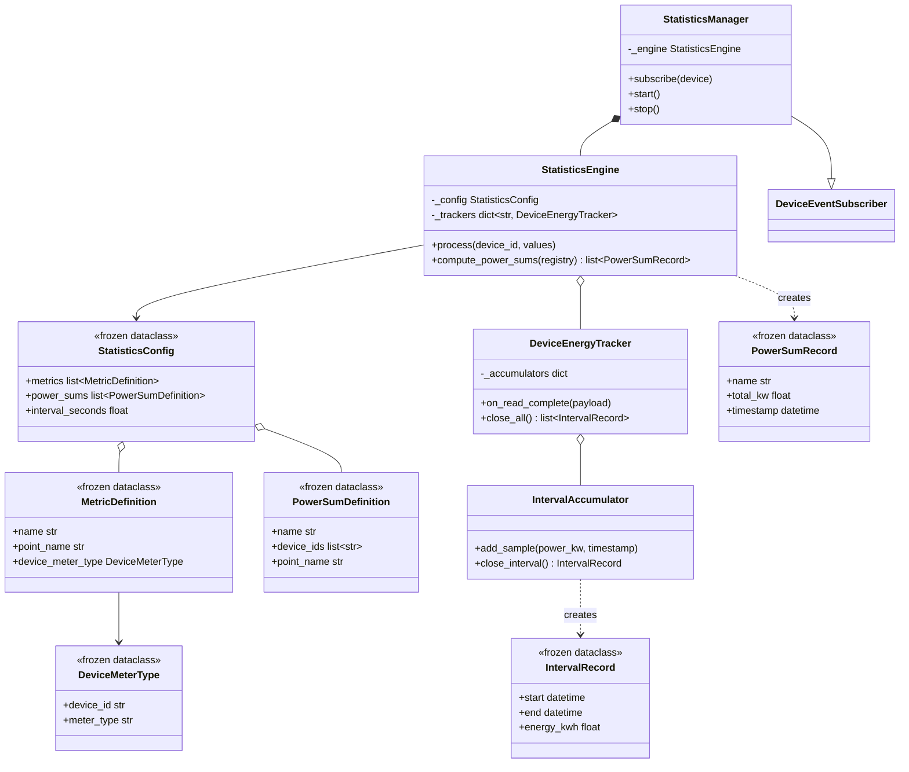
