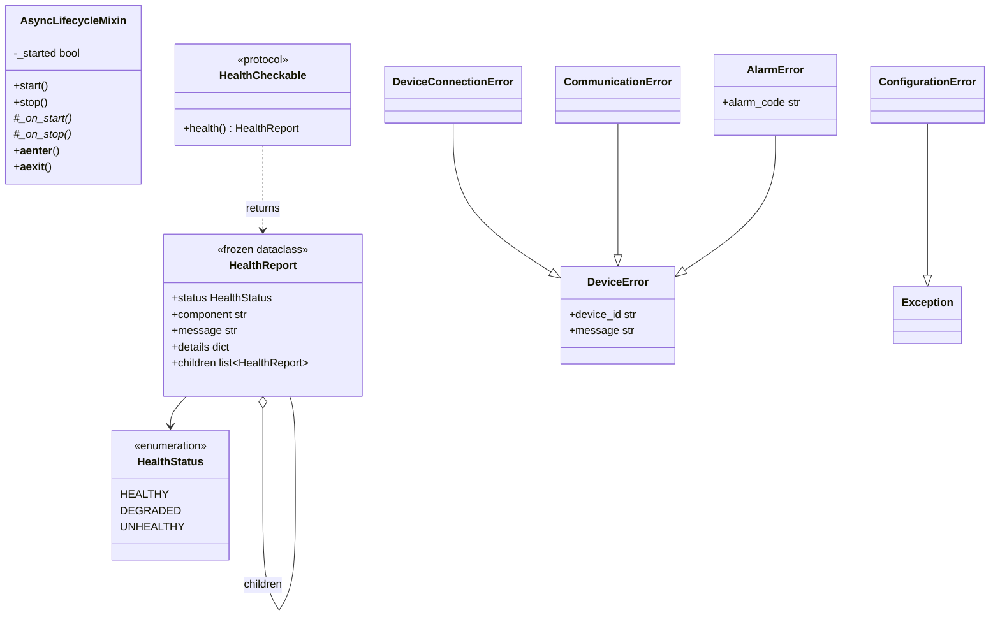
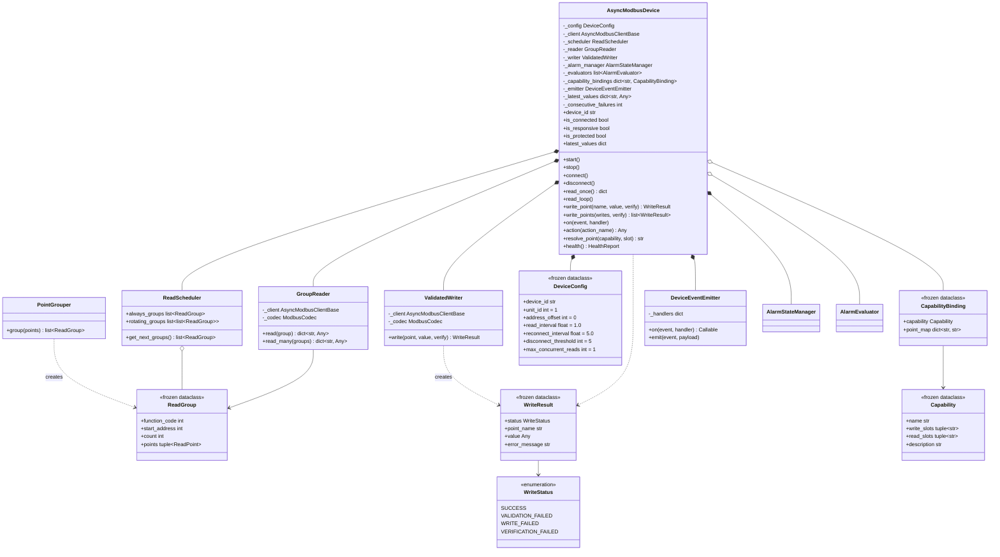
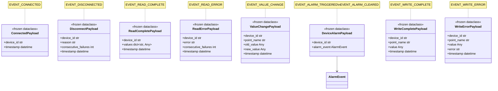
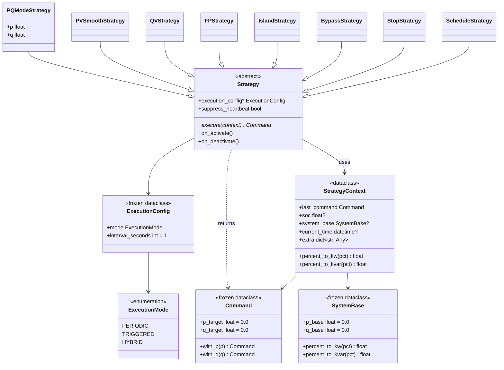
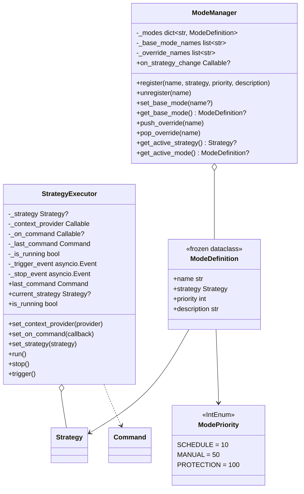
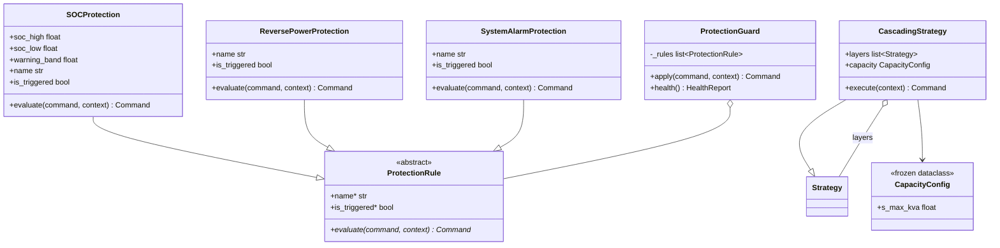
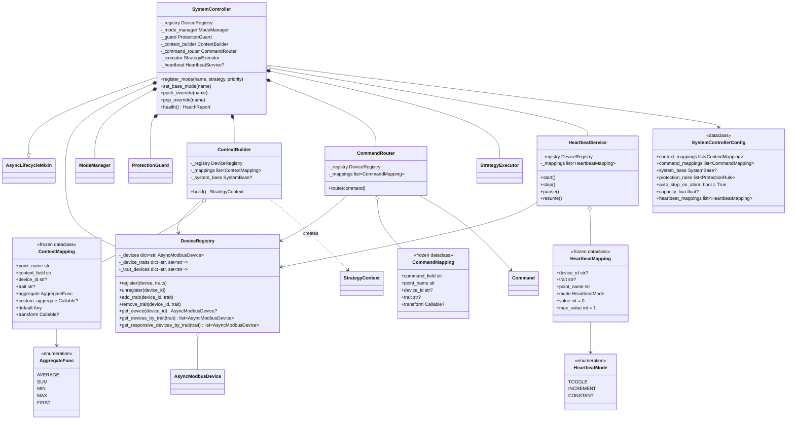
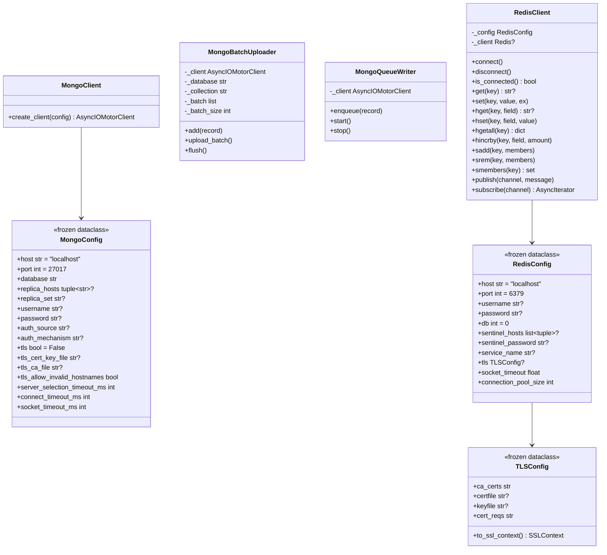
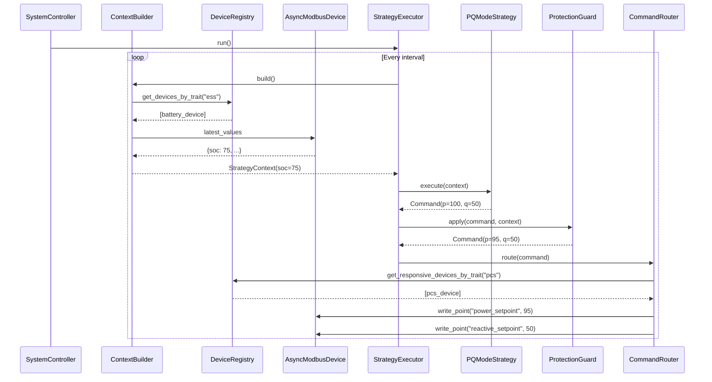

# UML Class Diagrams — csp_lib

## 1. Architecture Overview

High-level view of the layered architecture with key classes and their relationships.

```mermaid
classDiagram
    direction TB

    namespace Core {
        class AsyncLifecycleMixin {
            +start()
            +stop()
            +__aenter__()
            +__aexit__()
        }
        class HealthCheckable {
            <<protocol>>
            +health() HealthReport
        }
        class DeviceError
        class ConfigurationError
    }

    namespace Modbus {
        class ModbusDataType {
            <<abstract>>
            +register_count int
            +encode() list~int~
            +decode() Any
        }
        class AsyncModbusClientBase {
            <<abstract>>
            +connect()
            +disconnect()
            +read_holding_registers()
            +write_multiple_registers()
        }
        class ModbusCodec {
            +encode()
            +decode()
        }
    }

    namespace Equipment {
        class AsyncModbusDevice {
            +device_id str
            +is_connected bool
            +latest_values dict
            +start()
            +stop()
            +read_once()
            +write_point()
            +on()
        }
        class DeviceConfig
        class ReadPoint
        class WritePoint
        class ProcessingPipeline
        class AlarmStateManager
        class DeviceEventEmitter
        class GroupReader
        class ReadScheduler
        class ValidatedWriter
    }

    namespace Controller {
        class Strategy {
            <<abstract>>
            +execute(ctx) Command
            +on_activate()
            +on_deactivate()
        }
        class StrategyExecutor {
            +set_strategy()
            +run()
            +stop()
            +trigger()
        }
        class ModeManager {
            +register()
            +set_base_mode()
            +push_override()
            +pop_override()
            +get_active_strategy()
        }
        class ProtectionGuard {
            +apply(cmd, ctx) Command
        }
        class Command {
            +p_target float
            +q_target float
        }
        class StrategyContext {
            +soc float
            +last_command Command
            +system_base SystemBase
        }
    }

    namespace Manager {
        class UnifiedDeviceManager {
            +register_device()
            +register_group()
        }
        class DeviceManager {
            +register()
            +register_group()
        }
        class AlarmPersistenceManager
        class WriteCommandManager
        class DataUploadManager
        class StateSyncManager
    }

    namespace Integration {
        class SystemController {
            +register_mode()
            +set_base_mode()
            +push_override()
            +pop_override()
            +health()
        }
        class DeviceRegistry {
            +register()
            +get_device()
            +get_devices_by_trait()
        }
        class ContextBuilder {
            +build() StrategyContext
        }
        class CommandRouter {
            +route(cmd)
        }
    }

    namespace Storage {
        class MongoClient
        class MongoBatchUploader
        class RedisClient
    }

    %% Core inheritance
    AsyncModbusDevice ..|> HealthCheckable
    DeviceManager --|> AsyncLifecycleMixin
    UnifiedDeviceManager --|> AsyncLifecycleMixin
    SystemController --|> AsyncLifecycleMixin

    %% Equipment composition
    AsyncModbusDevice *-- DeviceConfig
    AsyncModbusDevice *-- AsyncModbusClientBase
    AsyncModbusDevice *-- GroupReader
    AsyncModbusDevice *-- ReadScheduler
    AsyncModbusDevice *-- ValidatedWriter
    AsyncModbusDevice *-- AlarmStateManager
    AsyncModbusDevice *-- DeviceEventEmitter
    AsyncModbusDevice o-- ReadPoint
    AsyncModbusDevice o-- WritePoint

    ReadPoint *-- ProcessingPipeline
    GroupReader --> AsyncModbusClientBase
    GroupReader --> ModbusCodec

    %% Controller composition
    StrategyExecutor o-- Strategy
    StrategyExecutor --> StrategyContext
    StrategyExecutor --> Command
    ModeManager o-- ModeDefinition
    ProtectionGuard o-- ProtectionRule

    %% Manager composition
    UnifiedDeviceManager *-- DeviceManager
    UnifiedDeviceManager o-- AlarmPersistenceManager
    UnifiedDeviceManager o-- WriteCommandManager
    UnifiedDeviceManager o-- DataUploadManager
    UnifiedDeviceManager o-- StateSyncManager
    DeviceManager o-- AsyncModbusDevice

    %% Integration composition
    SystemController *-- ModeManager
    SystemController *-- ProtectionGuard
    SystemController *-- ContextBuilder
    SystemController *-- CommandRouter
    SystemController *-- StrategyExecutor
    SystemController *-- DeviceRegistry
    ContextBuilder --> DeviceRegistry
    CommandRouter --> DeviceRegistry
    ContextBuilder ..> StrategyContext : creates
    CommandRouter ..> Command : consumes

    %% Storage usage
    AlarmPersistenceManager --> MongoClient
    DataUploadManager --> MongoBatchUploader
    StateSyncManager --> RedisClient
```

---

## 2. Core Layer

---

## 3. Modbus Layer

---

## 4. Equipment Layer

### 4a. Points & Transforms

### 4b. Alarm System

### 4c. Transport & Device

### 4d. Device Events

---

## 5. Controller Layer

### 5a. Command & Strategy

### 5b. Executor & Mode Management

### 5c. Protection & Cascading

---

## 6. Manager Layer

---

## 7. Integration Layer

---

## 8. Storage Layer

---

## 9. Data Flow — PQ Control Sequence

