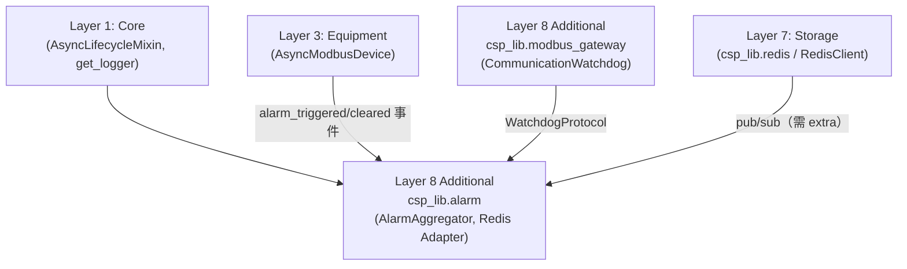

---
tags:
  - type/moc
  - status/complete
updated: 2026-04-17
version: ">=0.8.2"
---

# _MOC Alarm

> `csp_lib.alarm` — In-process 告警聚合與 Redis pub/sub 橋接（v0.8.2 新增）

## 概述

Alarm 模組提供跨 source 的告警聚合原語，以及與 Redis pub/sub 的橋接器，適用於多設備告警聚合與分散式多 node 聯動停機場景。

**模組路徑**：`csp_lib.alarm`（Layer 8 Additional，依賴 Core 與可選 redis extra）

```python
from csp_lib.alarm import (
    AlarmAggregator,
    WatchdogProtocol,
    AlarmChangeCallback,
    # 需要 csp_lib[redis]：
    RedisAlarmPublisher,
    RedisAlarmSource,
)
```

---

## 頁面索引

### 核心元件

- [[AlarmAggregator]] — 多 source OR 聚合器，含 `bind_device` / `bind_watchdog` / `on_change`
- [[Redis Adapter]] — `RedisAlarmPublisher`（本機→Redis）與 `RedisAlarmSource`（Redis→本機）

### Protocols 與型別別名

| 名稱 | 說明 |
|------|------|
| `WatchdogProtocol` | Watchdog 結構化協定（`on_timeout` / `on_recover`） |
| `AlarmChangeCallback` | `Callable[[bool], None]`，on_change callback 型別 |

---

## 架構定位



> [!note] 依賴方向
> `csp_lib.alarm` 不依賴 Integration（Layer 6）或 Controller（Layer 4）；透過 Protocol 描述 Watchdog 介面，保持依賴方向正確。

---

## 常見使用場景

### 日本 demo：整廠多 node 聯動停機

```
本機 AlarmAggregator
  ├─ bind_device(pcs_a)
  ├─ bind_watchdog(comm_wd, name="gateway_wd")
  └─ RedisAlarmPublisher → Redis channel: gateway:alarm

遠端 node
  └─ RedisAlarmSource(channel: gateway:alarm) → AlarmAggregator → on_change(stop!)
```

### 本機 in-process 策略鎖定

```
AlarmAggregator.on_change
  └─ active=True  → asyncio.create_task(mode_manager.push_override("ramp_stop"))
  └─ active=False → asyncio.create_task(mode_manager.pop_override("ramp_stop"))
```

---

## Dataview 索引

```dataview
TABLE source AS "來源模組", version AS "版本"
FROM "17-Alarm"
WHERE !contains(file.name, "_MOC")
SORT file.name ASC
```

---

## 相關模組

| 模組 | 說明 |
|------|------|
| [[_MOC Core]] | `AsyncLifecycleMixin` 基類 |
| [[_MOC Equipment]] | `AsyncModbusDevice` alarm 事件 |
| [[_MOC Modbus Gateway]] | `CommunicationWatchdog`（`WatchdogProtocol` 實作） |
| [[_MOC Storage]] | Redis client（`csp_lib[redis]` extra） |
