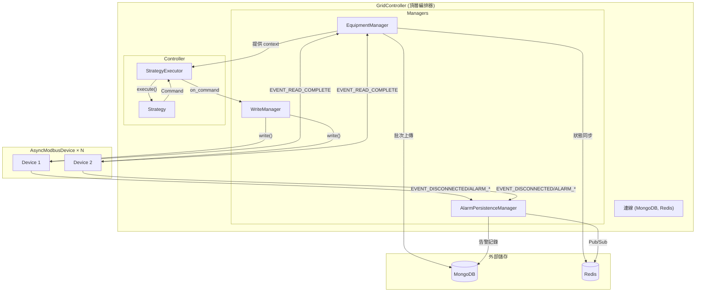

# GridController 整合架構設計

整合 Equipment、Controller、Manager 模組，建構完整的控制系統。

---

## 架構總覽



---

## 事件流向

```
┌─────────────────────────────────────────────────────────────────────────┐
│                              GridController                              │
├─────────────────────────────────────────────────────────────────────────┤
│                                                                         │
│  ┌──────────┐    READ_COMPLETE     ┌──────────────────┐                │
│  │          │ ──────────────────▶ │ EquipmentManager │                │
│  │          │                      │   - DB 批次上傳   │                │
│  │          │                      │   - Redis 同步    │                │
│  │ Devices  │                      └────────┬─────────┘                │
│  │          │                               │                           │
│  │          │    DISCONNECTED              │ 提供 latest_values       │
│  │          │    ALARM_*                   ▼                           │
│  │          │ ─────────────────▶ ┌──────────────────┐                 │
│  │          │                    │  AlarmPersistence │                 │
│  └──────────┘                    │    Manager        │                 │
│                                  └────────┬─────────┘                 │
│                                           │                            │
│                                           │                            │
│  ┌──────────────────────────────────────────────────────────────┐     │
│  │                     StrategyExecutor                          │     │
│  │  context_provider() ◀── EquipmentManager.get_context()       │     │
│  │           │                                                   │     │
│  │           ▼                                                   │     │
│  │  ┌─────────────┐         ┌─────────────┐                     │     │
│  │  │  Strategy   │ ──────▶│   Command   │                     │     │
│  │  └─────────────┘         └──────┬──────┘                     │     │
│  │                                 │                             │     │
│  └─────────────────────────────────┼─────────────────────────────┘     │
│                                    │ on_command                        │
│                                    ▼                                   │
│                           ┌──────────────┐                             │
│                           │ WriteManager │                             │
│                           │  - 分發寫入   │                             │
│                           │  - 驗證結果   │                             │
│                           └──────────────┘                             │
│                                                                         │
└─────────────────────────────────────────────────────────────────────────┘
```

---

## 目錄結構

```
csp_lib/
├── controller/              # 策略與執行器 (已存在)
│   ├── core/
│   ├── executor/
│   └── strategies/
│
├── equipment/               # 設備抽象 (已存在)
│   ├── alarm/
│   ├── device/
│   └── transport/
│
├── manager/                 # 【新增】管理器模組
│   ├── __init__.py
│   ├── equipment.py         # EquipmentManager
│   ├── writer.py            # WriteManager (新增)
│   ├── alarm/               # AlarmPersistenceManager
│   │   ├── __init__.py
│   │   ├── schema.py
│   │   ├── repository.py
│   │   ├── notifier.py
│   │   └── persistence.py
│   └── grid.py              # 【新增】GridController
│
└── mongo/                   # MongoDB 工具 (已存在)
```

---

## Proposed Changes

### [NEW] [grid.py](file:///d:/Lab/博班/通用模版/common/csp_lib/manager/grid.py)

頂層控制器，整合所有子系統。

```python
"""GridController - 頂層編排器"""

from __future__ import annotations

from dataclasses import dataclass
from typing import TYPE_CHECKING, Any, Sequence

from motor.motor_asyncio import AsyncIOMotorClient, AsyncIOMotorDatabase

from csp_lib.controller import Command, Strategy, StrategyContext, StrategyExecutor
from csp_lib.core import get_logger

from .alarm import AlarmPersistenceManager, MongoAlarmRepository, RedisAlarmNotifier
from .equipment import EquipmentManager
from .writer import WriteManager

if TYPE_CHECKING:
    from csp_lib.equipment.device import AsyncModbusDevice

logger = get_logger(__name__)


@dataclass
class GridConfig:
    """GridController 配置"""
    mongo_uri: str
    mongo_db: str
    redis_client: Any | None = None  # aioredis client
    db_write_interval: float = 1.0
    strategy_interval: float = 1.0


class GridController:
    """
    頂層編排器
    
    整合：
    - EquipmentManager: 設備讀取、DB 上傳、Redis 狀態同步
    - AlarmPersistenceManager: 告警持久化
    - StrategyExecutor: 策略執行
    - WriteManager: 命令分發寫入
    
    使用範例：
        ```python
        config = GridConfig(
            mongo_uri="mongodb://localhost:27017",
            mongo_db="grid_db",
            redis_client=redis,
        )
        
        grid = GridController(config)
        
        # 註冊設備
        grid.register_device(pcs, collection="PCS")
        grid.register_device(meter, collection="Meter")
        
        # 設定策略
        grid.set_strategy(PVSmoothStrategy(config))
        
        # 啟動
        async with grid:
            await asyncio.Event().wait()  # 持續運行
        ```
    """

    def __init__(self, config: GridConfig) -> None:
        self._config = config
        
        # 連線 (延遲初始化)
        self._mongo_client: AsyncIOMotorClient | None = None
        self._db: AsyncIOMotorDatabase | None = None
        
        # 子系統 (延遲初始化)
        self._equipment_manager: EquipmentManager | None = None
        self._alarm_manager: AlarmPersistenceManager | None = None
        self._write_manager: WriteManager | None = None
        self._strategy_executor: StrategyExecutor | None = None
        
        # 待註冊設備
        self._pending_devices: list[tuple[AsyncModbusDevice, str]] = []
        self._strategy: Strategy | None = None

    # ========== 註冊 API ==========

    def register_device(
        self,
        device: AsyncModbusDevice,
        collection: str = "IO",
    ) -> GridController:
        """註冊設備"""
        self._pending_devices.append((device, collection))
        return self

    def set_strategy(self, strategy: Strategy) -> None:
        """設定控制策略"""
        self._strategy = strategy
        if self._strategy_executor:
            self._strategy_executor.set_strategy(strategy)

    # ========== 生命週期 ==========

    async def start(self) -> None:
        """啟動所有子系統"""
        logger.info("GridController: 初始化中...")
        
        # 1. 建立連線
        self._mongo_client = AsyncIOMotorClient(self._config.mongo_uri)
        self._db = self._mongo_client[self._config.mongo_db]
        
        # 2. 初始化子系統
        # TODO: 整合 MongoBatchUploader 和 StateSync
        self._equipment_manager = EquipmentManager(
            batch_uploader=None,  # 需傳入實際 uploader
            state_sync=None,
            db_write_interval=self._config.db_write_interval,
        )
        
        # 告警管理
        alarm_repo = MongoAlarmRepository(self._db)
        await alarm_repo.ensure_indexes()
        
        notifier = None
        if self._config.redis_client:
            notifier = RedisAlarmNotifier(self._config.redis_client)
        
        self._alarm_manager = AlarmPersistenceManager(
            repository=alarm_repo,
            notifier=notifier,
        )
        
        # 寫入管理
        self._write_manager = WriteManager()
        
        # 策略執行
        self._strategy_executor = StrategyExecutor(
            context_provider=self._build_context,
            on_command=self._on_command,
        )
        
        if self._strategy:
            self._strategy_executor.set_strategy(self._strategy)
        
        # 3. 註冊待處理設備
        for device, collection in self._pending_devices:
            self._equipment_manager.register(device, collection)
            self._alarm_manager.subscribe(device)
            self._write_manager.register(device)
        
        # 4. 啟動
        await self._equipment_manager.start_all()
        await self._alarm_manager.sync(self._equipment_manager.equipments)
        
        # 啟動策略執行迴圈 (背景任務)
        import asyncio
        asyncio.create_task(self._strategy_executor.run())
        
        logger.info("GridController: 啟動完成")

    async def stop(self) -> None:
        """停止所有子系統"""
        logger.info("GridController: 停止中...")
        
        if self._strategy_executor:
            self._strategy_executor.stop()
        
        if self._equipment_manager:
            await self._equipment_manager.stop_all()
        
        if self._mongo_client:
            self._mongo_client.close()
        
        logger.info("GridController: 已停止")

    async def __aenter__(self) -> GridController:
        await self.start()
        return self

    async def __aexit__(self, *args) -> None:
        await self.stop()

    # ========== Private ==========

    def _build_context(self) -> StrategyContext:
        """建構策略上下文"""
        # 從 EquipmentManager 取得最新值
        # 實際實作需根據你的 StrategyContext 需求調整
        return StrategyContext(
            extra={"devices": {
                entry.equipment_id: entry.equipment.latest_values
                for entry in self._equipment_manager._entries
            }} if self._equipment_manager else {},
        )

    async def _on_command(self, command: Command) -> None:
        """處理策略輸出命令"""
        if self._write_manager:
            await self._write_manager.execute(command)
```

---

### [NEW] [writer.py](file:///d:/Lab/博班/通用模版/common/csp_lib/manager/writer.py)

寫入管理器，分發命令到設備。

```python
"""WriteManager - 命令分發寫入"""

from __future__ import annotations

from typing import TYPE_CHECKING

from csp_lib.controller import Command
from csp_lib.core import get_logger

if TYPE_CHECKING:
    from csp_lib.equipment.device import AsyncModbusDevice

logger = get_logger(__name__)


class WriteManager:
    """
    寫入管理器
    
    職責：
    - 接收 StrategyExecutor 輸出的 Command
    - 根據 Command 內容分發寫入到對應設備
    - 處理寫入結果與錯誤
    """

    def __init__(self) -> None:
        self._devices: dict[str, AsyncModbusDevice] = {}

    def register(self, device: AsyncModbusDevice) -> None:
        """註冊可寫入設備"""
        self._devices[device.device_id] = device
        logger.info(f"WriteManager: 註冊設備 {device.device_id}")

    async def execute(self, command: Command) -> None:
        """
        執行命令寫入
        
        Args:
            command: 策略輸出命令
        """
        # 根據 command 內容決定寫入邏輯
        # 這裡需要根據你的 Command 結構實作
        
        # 範例：假設 Command 有 p_target, q_target
        # 需要寫入到 PCS 設備
        if not command.p_target and not command.q_target:
            return
        
        for device_id, device in self._devices.items():
            try:
                # 實際寫入邏輯依 Command 結構而定
                if hasattr(command, 'p_target') and command.p_target is not None:
                    result = await device.write("p_setpoint", command.p_target)
                    if not result.status.is_success:
                        logger.error(f"WriteManager: {device_id} 寫入 P 失敗: {result.error_message}")
                
                if hasattr(command, 'q_target') and command.q_target is not None:
                    result = await device.write("q_setpoint", command.q_target)
                    if not result.status.is_success:
                        logger.error(f"WriteManager: {device_id} 寫入 Q 失敗: {result.error_message}")
                        
            except Exception as e:
                logger.exception(f"WriteManager: {device_id} 寫入異常: {e}")
```

---

### [MODIFY] [__init__.py](file:///d:/Lab/博班/通用模版/common/csp_lib/manager/__init__.py)

更新匯出。

```python
# =============== Manager Module ===============
#
# 管理器模組匯出

from .equipment import EquipmentEntry, EquipmentManager, EquipmentStateSyncProtocol
from .writer import WriteManager
from .grid import GridConfig, GridController

from .alarm import (
    AlarmNotification,
    AlarmNotifier,
    AlarmNotifyType,
    AlarmPersistenceManager,
    AlarmRecord,
    AlarmRepository,
    AlarmStatus,
    AlarmType,
    MongoAlarmRepository,
    RedisAlarmNotifier,
)

__all__ = [
    # Grid
    "GridController",
    "GridConfig",
    # Equipment
    "EquipmentManager",
    "EquipmentEntry",
    "EquipmentStateSyncProtocol",
    # Writer
    "WriteManager",
    # Alarm
    "AlarmRecord",
    "AlarmType",
    "AlarmStatus",
    "AlarmRepository",
    "MongoAlarmRepository",
    "AlarmNotifier",
    "RedisAlarmNotifier",
    "AlarmNotification",
    "AlarmNotifyType",
    "AlarmPersistenceManager",
]
```

---

## 使用範例

```python
import asyncio
from csp_lib.manager import GridController, GridConfig
from csp_lib.controller import PVSmoothStrategy, PVSmoothConfig

# 配置
config = GridConfig(
    mongo_uri="mongodb://localhost:27017",
    mongo_db="microgrid",
    redis_client=redis,
)

# 建立控制器
grid = GridController(config)

# 註冊設備
grid.register_device(pcs, "PCS")
grid.register_device(meter, "Meter")
grid.register_device(bms, "BMS")

# 設定策略
grid.set_strategy(PVSmoothStrategy(PVSmoothConfig(...)))

# 運行
async with grid:
    await asyncio.Event().wait()
```

---

## 設計決策

| 決策 | 理由 |
|------|------|
| `GridController` 作為 Facade | 簡化使用，隱藏內部複雜性 |
| 子系統依賴注入 | 可測試、可替換實作 |
| `_build_context` 提供 StrategyContext | 解耦策略與設備細節 |
| `WriteManager` 獨立 | 寫入邏輯可能複雜（驗證、重試、排序） |
